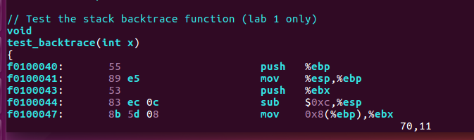

# Exercise 10

**为了能够更好的了解在x86上的C程序调用过程的细节，我们首先找到在obj/kern/kern.asm中test_backtrace子程序的地址， 设置断点，并且探讨一下在内核启动后，这个程序被调用时发生了什么。对于这个循环嵌套调用的程序test_backtrace，它一共压入了多少信息到堆栈之中。并且它们都代表什么含义？**

**答：**

　　先找到这个子程序的地址，打开obj/kern/kern.asm。在这个文件中我们查到调用test_backtrace子程序指令的地址为0xf0100040.



　　所以我们在这里设置断点，并且开始调试。

　　首先看一下test_backtrace的C语言形式：

```c
void
test_backtrace(int x)
{
    cprintf("entering test_backtrace %d\n", x);
    if (x > 0)
        test_backtrace(x-1);
    else
        mon_backtrace(0, 0, 0);
    cprintf("leaving test_backtrace %d\n", x);
}
```

　  可见这个子程序是一个循环调用，在每一层循环中先打印信息 "entering test_backtrace x"，然后对test_backtrace进行循环调用。当被循环调用完成，再打印信息 "leaving test_backtrace x"。所以最先进入的程序会最后退出。由于在init中对这个函数调用的次数为设置为5，所以屏幕上会打印出下列信息。

　　

　　下面具体看一些每次调用所执行的汇编程序，当每一次进入test_backtrace后，刚刚开始时，它要完成之前介绍过的过程调用的通用操作，如下：

```assembly
1     push %ebp
2     mov %esp, %ebp
3     push %ebx
4     sub $0x14, %esp
```

这四个操作将被用于存放调用这个子程序的父程序的栈帧信息，以及为当前子程序分配新的栈帧。在Exercise 1.9中，我们已经讨论过，entry.S文件中为整个内核设置了堆栈空间的地址范围，从0xf0108000-0xf0110000。由于堆栈是向下增长的，所以在运行init函数之前，esp寄存器的值就是0xf0110000，代表堆栈尚未使用。进入i386_init函数后，如果要调用某个子程序，就会把 i386_init 程序的栈帧信息压入到这个堆栈空间中。

　　在 i386_init 函数中，运行了子程序test_backtrace(5)。

　　当运行test_backtrace(5)之前，esp寄存器ebp寄存器的值分别为如下：

　　　　**esp ： 0xf010ffe0   ebp : 0xf010fff8**

　　0xf010ffe0~0xf010fff8就是当前i386_init子程序的栈帧，当计算机要调用test_backtrace(5)程序时，

　　首先call指令把i386_init的返回地址压入堆栈中，所以esp变为0xf010ffdc，然后进入test_backtrace(5)子程序。

　　子程序中第一句push %ebp，把i386_init的ebp寄存器的值压入堆栈中，即地址0xf010ffd8处，此时esp的值变为0xf010ffd8。

　　然后 mov %esp, %ebp 把ebp的值更新为esp的值，0xf010ffd8。这个就是当前test子程序的ebp寄存器的值。即它的栈帧的高地址边界。

　　然后 push %ebx 把ebx寄存器的值压入堆栈，此时esp变为0xf010ffd4。因为%ebx寄存器可能被这个子程序所使用，所以必须把它之前的值保留。

　　然后 sub $0x14, %esp 把esp中的值减去0x14=20，esp的值变为0xf010ffc0。这就是给test子程序分配一个大小为20个存储单元的额外的栈帧空间，供它存储一些临时变量的值。

　　所以上述4条汇编指令，执行完成后，esp，ebp寄存器的值变化为

　　　　esp : 0xf010ffc0   ebp：0xf010ffd8  

　　这就是test_backtrace(5)子程序运行时的栈帧地址范围。而输入参数'5'的值存放在0xf010ffe0单元处。

　　

　　紧接着就是调用test_backtrace(4)，由于它和test_backtrace(5)是一样的，只不过现在是在test_backtrace(5)中调用test_backtrace(4)，所以调用后内存中会同时存在二者的栈帧，test_backtrace(4)的栈帧就在test_backtrace(5)的栈帧之后。test_backtrace(4)中 esp， ebp的值也可以像我们分析test_backtrace(5)一样被分析出来，如下：

　　　 esp：0xf010ffa0   ebp：0xf010ffb8 

　　同理test_backtrace(3)中：

　　　 esp：0xf010ff80  ebp：0xf010ff98

　　test_backtrace(2)中：

　　　 esp：0xf010ff60  ebp：0xf010ff78

　　test_backtrace(1)中：

　　　 esp：0xf010ff40  ebp：0xf010ff58

　　test_backtrace(0)中：

　　  esp：0xf010ff20  ebp：0xf010ff38　　　

　　对于任意一层调用，比如test_backtrace(i)，它的esp和ebp的值假设分别为esp(i)和ebp(i)。那么在这个栈帧范围内主要存在这么几个重要的值：

　　首先ebp(i)所指向的内存单元处存放着上一层程序的ebp寄存器的值，即ebp(i-1)。

　　另外在esp(i)所指向的内存单元处存放着对下一层子程序调用时传入的参数，即i+1