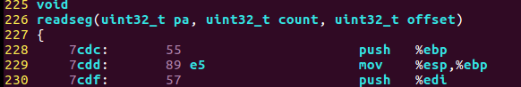

Exercise 3：

在地址 0x7c00 处设置断点，该地址将加载引导扇区。继续执行直到该断点。跟踪`boot/boot.S`中的代码，使用源代码和反汇编文件 `obj/boot/boot.asm`跟踪您的位置。还可以使用 GDB 中的`x/i`命令来反汇编引导加载程序中的指令序列，并将原始引导加载程序源代码与`obj/boot/boot.asm` 和 GDB 中的反汇编进行比较。

追踪到`boot/main.c`中的`bootmain()`，然后追踪到`readsect()`。`确定与readsect()`中的每个语句相对应的确切汇编指令。跟踪`readsect()`的其余部分 并返回`bootmain()` ，并确定从磁盘读取内核剩余扇区的`for`循环的开始和结束。找出循环结束时将运行的代码，在此处设置断点，然后继续执行该断点。然后逐步完成引导加载程序的其余部分。


/boot/boot.S 和 /boot/main.c 两个文件一起组成了 boot loader。其中，前者是一个汇编文件，后者是一个C语言文件。当BIOS运行完之后，CPU的控制权就会转移到 boot.S 文件上。所以，我们先看一下 boot.S 文件。

 /boot/boot.S ：

```assembly
  1 #include <inc/mmu.h>
  2 
  3 # Start the CPU: switch to 32-bit protected mode, jump into C.
  4 # The BIOS loads this code from the first sector of the hard disk into
  5 # memory at physical address 0x7c00 and starts executing in real mode
  6 # with %cs=0 %ip=7c00.
  7 
  8 .set PROT_MODE_CSEG, 0x8         # kernel code segment selector
  9 .set PROT_MODE_DSEG, 0x10        # kernel data segment selector
 10 .set CR0_PE_ON,      0x1         # protected mode enable flag
 11 
 12 .globl start
 13 start:
 14   .code16                     # Assemble for 16-bit mode
 15   cli                         # Disable interrupts
```

这几条指令就是 boot.S 最开始的几句，其中 cli 是 boot.S 也是 boot loader的第一条指令。这条指令用于把所有的中断都关闭掉。因为在 BIOS 运行期间，有可能打开中断。此时 CPU 工作在实模式下。

```assembly
 16   cld                         # String operations increment
```

这条指令用于指定之后发生的串处理操作的指针移动方向。

```assembly
 18   # Set up the important data segment registers (DS, ES, SS).
 19   xorw    %ax,%ax             # Segment number zero
 20   movw    %ax,%ds             # -> Data Segment
 21   movw    %ax,%es             # -> Extra Segment
 22   movw    %ax,%ss             # -> Stack Segment
```

这几条命令主要是在把三个段寄存器，ds，es，ss全部清零，因为经历了BIOS，操作系统不能保证这三个寄存器中存放的是什么数。所以这也是为后面进入保护模式做准备。

```assembly
 24   # Enable A20:
 25   #   For backwards compatibility with the earliest PCs, physical
 26   #   address line 20 is tied low, so that addresses higher than
 27   #   1MB wrap around to zero by default.  This code undoes this.
 28 seta20.1:
 29   inb     $0x64,%al               # Wait for not busy
 30   testb   $0x2,%al
 31   jnz     seta20.1
 32 
 33   movb    $0xd1,%al               # 0xd1 -> port 0x64
 34   outb    %al,$0x64
 35 
 36 seta20.2:
 37   inb     $0x64,%al               # Wait for not busy
 38   testb   $0x2,%al
 39   jnz     seta20.2
 40 
 41   movb    $0xdf,%al               # 0xdf -> port 0x60
 42   outb    %al,$0x60
```

这部分指令就是准备把CPU的工作模式从 实模式转换为保护模式。我们可以看到其中的指令包括inb，outb这样的IO端口命令。所以这些指令都是在对外部设备进行操作。

根据下面的链接：

　　 http://bochs.sourceforge.net/techspec/PORTS.LST

我们可以查看到，0x64端口属于键盘控制器804x，名称是控制器读取状态寄存器。下面是它各个位的含义。


所以29~31号指令是在不断的检测bit1。bit1的值代表输入缓冲区是否满了，也就是说CPU传送给控制器的数据，控制器是否已经取走了，如果CPU想向控制器传送新的数据的话，必须先保证这一位为0。所以这三条指令会一直等待这一位变为0，才能继续向后运行。

当0x64端口准备好读入数据后，现在就可以写入数据了，所以33~34这两条指令是把0xd1这条数据写入到0x64端口中。当向0x64端口写入数据时，则代表向键盘控制器804x发送指令。这个指令将会被送给0x60端口。


通过图中可见，D1指令代表下一次写入0x60端口的数据将被写入给804x控制器的输出端口。可以理解为下一个写入0x60端口的数据是一个控制指令。

　　然后36~39号指令又开始再次等待，等待刚刚写入的指令D1，是否已经被读取了。

　　如果指令被读取了，41~42号指令会向控制器输入新的指令，0xdf。通过查询我们看到0xDF指令的含义如下


这个指令的含义可以从图中看到，使能A20线，代表可以进入保护模式了。


```assembly
 44   # Switch from real to protected mode, using a bootstrap GDT
 45   # and segment translation that makes virtual addresses 
 46   # identical to their physical addresses, so that the 
 47   # effective memory map does not change during the switch.
 48   lgdt    gdtdesc
 49   movl    %cr0, %eax
 50   orl     $CR0_PE_ON, %eax
 51   movl    %eax, %cr0
```

首先48号指令 lgdt gdtdesc，是把gdtdesc这个标识符的值送入全局映射描述符表寄存器GDTR中。

这个GDT表是处理器工作于保护模式下一个非常重要的表。具体可以参照我们的Appendix 1关于实模式和保护模式的介绍。至于这条指令的功能就是把关于GDT表的一些重要信息存放到CPU的GDTR寄存器中，其中包括GDT表的内存起始地址，以及GDT表的长度。这个寄存器由48位组成，其中低16位表示该表长度，高32位表该表在内存中的起始地址。所以gdtdesc是一个标识符，标识着一个内存地址。从这个内存地址开始之后的6个字节中存放着GDT表的长度和起始地址。我们可以在这个文件的末尾看到gdtdesc，如下：

```
 75 # Bootstrap GDT
 76 .p2align 2                                # force 4 byte alignment
 77 gdt:
 78   SEG_NULL                              # null seg
 79   SEG(STA_X|STA_R, 0x0, 0xffffffff)     # code seg
 80   SEG(STA_W, 0x0, 0xffffffff)           # data seg
 81 
 82 gdtdesc:
 83   .word   0x17                            # sizeof(gdt) - 1
 84   .long   gdt                             # address gdt
```

其中第77行的gdt是一个标识符，标识从这里开始就是GDT表了。可见这个GDT表中包括三个表项(78,79,80行)，分别代表三个段，null seg，code seg，data seg。由于xv6其实并没有使用分段机制，也就是说数据和代码都是写在一起的，所以数据段和代码段的起始地址都是0x0，大小都是0xffffffff=4GB。

在第78~80行是调用SEG()子程序来构造GDT表项的。这个子函数定义在mmu.h中，形式如下：　

```assembly
　#define SEG(type,base,lim)                    \
                    .word (((lim) >> 12) & 0xffff), ((base) & 0xffff);    \
                    .byte (((base) >> 16) & 0xff), (0x90 | (type)),        \
                    (0xC0 | (((lim) >> 28) & 0xf)), (((base) >> 24) & 0xff)
```

可见函数需要3个参数，一是type即这个段的访问权限，二是base，这个段的起始地址，三是lim，即这个段的大小界限。gdt表中的每一个表项的结构如图所示：


每个表项一共8字节，其中limit_low就是limit的低16位。base_low就是base的低16位，依次类推，所以我们就可以理解SEG函数为什么要那么写（其实还是有很多不理解的。。）。

　　 然后在gdtdesc处就要存放这个GDT表的信息了，其中0x17是这个表的大小-1 = 0x17 = 23，至于为什么不直接存表的大小24，根据查询是官方规定的。紧接着就是这个表的起始地址gdt。

```assembly
 44   # Switch from real to protected mode, using a bootstrap GDT
 45   # and segment translation that makes virtual addresses 
 46   # identical to their physical addresses, so that the 
 47   # effective memory map does not change during the switch.
 48   lgdt    gdtdesc
 49   movl    %cr0, %eax
 50   orl     $CR0_PE_ON, %eax
 51   movl    %eax, %cr0
```

继续看这里，当加载完GDT表的信息到GDTR寄存器之后。紧跟着3个操作，49~51指令。 这几步操作明显是在修改CR0寄存器的内容。CR0寄存器还有CR1~CR3寄存器都是80x86的控制寄存器。其中$CR0_PE的值定义于"mmu.h"文件中，为0x00000001。可见上面的操作是把CR0寄存器的bit0置1，CR0寄存器的bit0是保护模式启动位，把这一位值1代表保护模式启动。

```assembly
 53   # Jump to next instruction, but in 32-bit code segment.
 54   # Switches processor into 32-bit mode.
 55   ljmp    $PROT_MODE_CSEG, $protcseg
```

这只是一个简单的跳转指令，这条指令的目的在于把当前的运行模式切换成32位地址模式

```assembly
 58 protcseg:
 59   # Set up the protected-mode data segment registers
 60   movw    $PROT_MODE_DSEG, %ax    # Our data segment selector
 61   movw    %ax, %ds                # -> DS: Data Segment
 62   movw    %ax, %es                # -> ES: Extra Segment
 63   movw    %ax, %fs                # -> FS
 64   movw    %ax, %gs                # -> GS
 65   movw    %ax, %ss                # -> SS: Stack Segment
```

 修改这些寄存器的值。这些寄存器都是段寄存器。大家可以戳这个链接看一下具体介绍 http://www.eecg.toronto.edu/~amza/[www.mindsec.com/files/x86regs.html](http://www.mindsec.com/files/x86regs.html)

```assembly
 67   # Set up the stack pointer and call into C.
 68   movl    $start, %esp
 69   call bootmain
```

接下来的指令就是要设置当前的esp寄存器的值，然后准备正式跳转到main.c文件中的bootmain函数处。我们接下来分析一下这个函数的每一条指令：

```c
 43         // read 1st page off disk
 44         readseg((uint32_t) ELFHDR, SECTSIZE*8, 0);
```

这里面调用了一个函数readseg，这个函数在bootmain之后被定义了：

```c
 readseg(uint32_t pa, uint32_t count, uint32_t offset)
```

它的功能从注释上来理解应该是，把距离内核起始地址offset个偏移量存储单元作为起始，将它和它之后的count字节的数据读出送入以pa为起始地址的内存物理地址处。

　 所以这条指令是把内核的第一个页(4MB = 4096 = SECTSIZE*8 = 512*8)的内容读取的内存地址ELFHDR(0x10000)处。其实完成这些后相当于把操作系统映像文件的elf头部读取出来放入内存中。

　 读取完这个内核的elf头部信息后，需要对这个elf头部信息进行验证，并且也需要通过它获取一些重要信息。所以有必要了解下elf头部。

 elf文件：elf是一种文件格式，主要被用来把程序存放到磁盘上。是在程序被编译和链接后被创建出来的。一个elf文件包括多个段。对于一个可执行程序，通常包含存放代码的文本段(text section)，存放全局变量的data段，存放字符串常量的rodata段。elf文件的头部就是用来描述这个elf文件如何在存储器中存储。

  需要注意的是，你的文件是可链接文件还是可执行文件，会有不同的elf头部格式。

```c
 46         // is this a valid ELF?
 47         if (ELFHDR->e_magic != ELF_MAGIC)
 48                 goto bad;
```

 elf头部信息的magic字段是整个头部信息的开端。并且如果这个文件是格式是ELF格式的话，文件的elf->magic域应该是=ELF_MAGIC的，所以这条语句就是判断这个输入文件是否是合法的elf可执行文件。

```c
 51         ph = (struct Proghdr *) ((uint8_t *) ELFHDR + ELFHDR->e_phoff);
```

　 我们知道头部中一定包含Program Header Table。这个表格存放着程序中所有段的信息。通过这个表我们才能找到要执行的代码段，数据段等等。所以我们要先获得这个表。

　 这条指令就可以完成这一点，首先elf是表头起址，而phoff字段代表Program Header Table距离表头的偏移量。所以ph可以被指定为Program Header Table表头。

```c
 52         eph = ph + ELFHDR->e_phnum;
```

 由于phnum中存放的是Program Header Table表中表项的个数，即段的个数。所以这步操作是吧eph指向该表末尾。

```c
 53         for (; ph < eph; ph++)
 54                 // p_pa is the load address of this segment (as well
 55                 // as the physical address)
 56                 readseg(ph->p_pa, ph->p_memsz, ph->p_offset);
```

　 这个for循环就是在加载所有的段到内存中。ph->paddr根据参考文献中的说法指的是这个段在内存中的物理地址。ph->off字段指的是这一段的开头相对于这个elf文件的开头的偏移量。ph->filesz字段指的是这个段在elf文件中的大小。ph->memsz则指的是这个段被实际装入内存后的大小。通常来说memsz一定大于等于filesz，因为段在文件中时许多未定义的变量并没有分配空间给它们。

　  所以这个循环就是在把操作系统内核的各个段从外存读入内存中。

```c
 58         // call the entry point from the ELF header
 59         // note: does not return!
 60         ((void (*)(void)) (ELFHDR->e_entry))();
```

 e_entry字段指向的是这个文件的执行入口地址。所以这里相当于开始运行这个文件。也就是内核文件。 自此就把控制权从boot loader转交给了操作系统的内核。

  以上就是我们对这两个文件的分析。


 首先完成第一部分，即对boot.S程序的跟踪，我们还是要采用gdb。首先打开一个terminal，并且cd到xv6的根目录下，输入make qemu-gdb。然后再打开一个terminal也来到xv6的根目录下，输入make gdb，我们就可以开始调试了。


在gdb窗口中输入 b *0x7c00，然后再输入c，表示继续运行到断点处，在这里我们输入

​		x/30i 0x7c00


这条gdb指令是把存放在0x7c00以及之后30字节的内存里面的指令反汇编出来，我们可以拿它直接和boot.S以及在obj/boot/boot.asm进行比较，如下：

　首先是obj/boot/boot.asm


然后是boot.S


可见这三者在指令上没有区别，只不过在源代码中，我们指定了很多标识符比如set20.1，.start，这些标识符在被汇编成机器代码后都会被转换成真实物理地址。比如set20.1就被转换为0x7c0a，那么在obj/boot/boot.asm中还把这种对应关系列出来了，但是在真实执行时，即第一种情况中，就看不到set20.1标识符了，完全是真实物理地址。

  紧接着完成Exercise的第二部分：

　我们可以对bootmain函数中的语句逐一分析：

　首先在boot.S中的最后一句是

 ```assembly
  69   call bootmain
 ```

​	call指令将会把返回地址压入栈中，然后把bootmain的起始地址赋给%eip寄存器的值，所以在这句指令执行后%eip 的值变为 0x7d0b

　因为我们从obj/boot/boot.asm 文件中，正好可以看到bootmain函数的汇编形式：


 可见bootmain翻译成汇编程序的第一条指令是push %ebp，地址为0x7d0b。所以正好和%eip的值对上。另外%esp寄存器中的值由0x7c00，变为0x7bfc。其中0x7bfd~0x7c00中存放的值是boot.S运行时的返回地址。

 然后我们开始正式分析bootmain函数，上图中的四句汇编代码是进行过程调用时，被调过程必须要事先执行的一些通用的任务。

关于汇编语言过程调用的知识，可以阅读Apendix 2

​    **1 0x7d0b  push  %esp**

​    **2 0x7d0c  mov  %esp, %ebp**

 这两句就是在修改栈帧界限的信息。阅读Appdenix 2，里面具体解释了这两句的含义。

​    **3. 0x7d0e  push  %esi**

​    **4  0x7d0f  push  %ebx**

 这两句操作是在备份%esi，%ebx的值，因为这两个寄存器叫做被调用者保存寄存器，即如果要在子过程中使用了它们，那么在子过程开头处必须先备份这些寄存器的值。

​    那么此时%esp的值为0x7bf0，而%ebp的值设置为0x7bf8。可见进入bootmain函数后，把0x7c00之前的低地址空间拿来作为栈帧使用。

 以上这些都属于过程调用的常见指令，下面进入bootmain的c语言程序部分。

 首先看第一条C语言指令 

```c
readseg((uint32_t) ELFHDR, SECTSIZE*8, 
```

 下面看下这条指令汇编的结果：


 **首先7d1a~7d21三条指令的目的是为了把三个输入参数压入栈帧之中，以供readseg子过程访问，%esp寄存器的值也随之改变为0x7be4。此时7d26执行，调用readseg子过程，该子过程的第一条指令地址为0x7cdc。**由于题目让我们深入到reagsec里面看看，但是reagsec只在readseg函数里面被调用了，所以必须深入到readseg。调用call时，会把bootmain下一个要执行的指令地址0x7d21压入堆栈0x7be0，所以%esp的值会变成0x7be0.

然后就开始进入readseg函数，进入readseg函数的头几个操作仍旧是跟子过程调用有关的，包括保存调用过程bootmain的栈帧信息，保存一个被调用者保存寄存器，%edi，的值。



 下一条汇编语句 **mov 0xc(%ebp), %edi  \**是要取出第二个输入参数即0x1000，4096到%edi寄存器中。\****

 因为此时的%ebp的值为0x7bdc，在这里面存放的是bootmain过程的%ebp值，0x04(%ebp)即0x7be0存放的是bootmain的返回地址，0x08(%ebp)存放的是第1个输入参数0x10000，0xc(%ebp)存放的是第2个参数0x1000，0x10(%ebp)中存放的是第3个参数0x00。（具体原理你看完Appendix 2就会明白。）

 **可见是把第3个参数0x0存入%esi，第1个参数0x10000存入%ebx。**由于这两个寄存器也是被调用者保护寄存器，所以在改变他们的值之前都会把他们之前的值压入堆栈。

 下一条要执行的汇编语句为 **shr $0x9 %esi**

  **由于shr是汇编逻辑右移指令，而%esi中存放的是第3个参数值，offset，将这个offset逻辑右移9位正好等于把offset的除以512即SECTSIZE，所以就是在完成**

  **offset = (offset / SECTSIZE) + 1指令的其中一部分。这条c语言指令的功能是计算要读取这段区域的第一个扇区的扇区号。**

 

 下一条汇编语句：  **add  %ebx, %edi**

　 **由于%ebx中存放的是第1个参数pa，%edi中存放的是第2个参数0x1000(即4096)，那么这条指令完成的就是C语言语句：**

　  **end_pa = pa + count;**

   这句指令是让end_pa指向要被读取到内存的这块数据所存放的最后一个位置的地址。

 

 下一条汇编语句： **inc %esi**

　　**这条语句很好理解就是在完成C语言语句 \**offset = (offset / SECTSIZE) + 1\**  \**中的加1的部分。\****

 

 下一条汇编语句： **and $0xfffffe00, %ebx**

　　**这条语句完成的是C语言语句： \**pa &= ~(SECTSIZE-1)\****  

　　功能就是把pa重新定向到offset存储单元所在的扇区的起始地址。

 

 下一条汇编语句： **jmp 7cff <readseg+0x2d>**

   **此时开始进入while循环，即开始把外存中的数据传输到内核。为了实现while循环，汇编通常采取的方式是就是这种先jmp，然后再判断循环条件的这种方法来实现。所以这条指令首先是要进行jmp，jump到判断循环条件的语句处，0x7cff.**

 

 下两条汇编语句： **cmp  %edi, %ebx**

　　　　　　　　　**jb 7cef <readseg+0x1d>**

   **这条语句就是在判断当前%ebx的值和%edi的值的大小，其中%ebx存放的就是指针pa，而%edi中存放的是指针end_pa，所以它执行的C语言指令就是 \**while(pa < end_pa) , \*\*那么当%edi即end_pa仍旧大于%ebx即pa时，则jb指令（大于时跳转）会跳转回while循环的第二个语句0x7cef。\*\**\***

　　

 下三条汇编语句： **push %esi** 

　　　　　　　　　 **inc %esi**

​             **push %ebx**

　　**这三条语句在为调用readsec函数而做准备，把输入参数先压入到堆栈中。**

 

 下面进入到readsec函数中： **call 7x81<readsec>**  

　　　　　　　　　　　　　　**push %ebp**

　　　　　　　　　　　　　**mov %esp, %ebp**

　　　　　　　　　　　　　**push %edi**

 　 首先还是过程调用时的通用操作，修改栈帧等操作。　　　　　　　　　　　　　 

 

 下一条指令: **call 7x6c<waitdisk>**

　　**这一条操作其实是调用了一个子函数，waitdisk()，这个函数用于查询当前磁盘的状态是否已经准备好进行操作。如果没有准备好，那么程序就会一直停在这里，直到磁盘准备好。**
