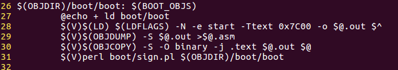
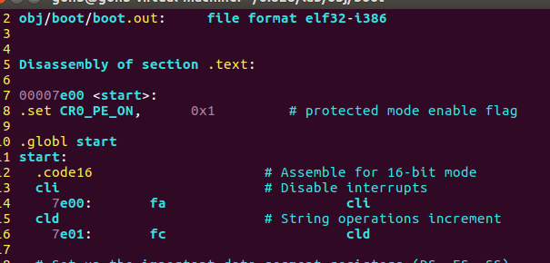
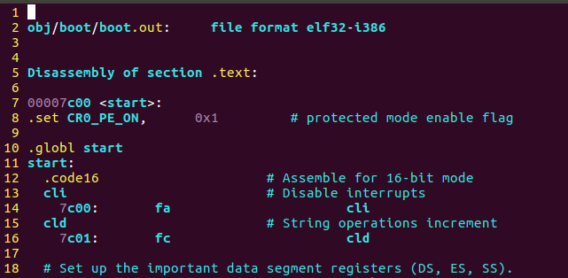
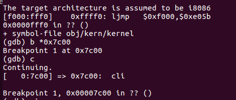
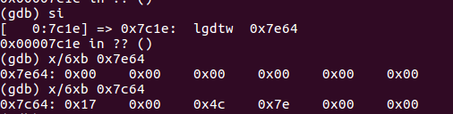
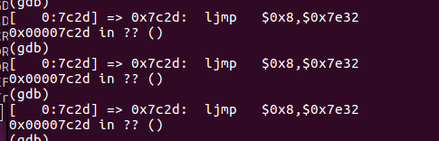

# Exercise 5

再一次追踪一下boot loader的一开始的几句指令，找到第一条满足如下条件的指令处：

　　**当我修改了boot loader的链接地址，这个指令就会出现错误。**

　　找到这样的指令后，把boot loader的链接地址修改一下，我们要在boot/Makefrag文件中修改它的链接地址，修改完成后运行 make clean， 然后通过make指令重新编译内核，再找到那条指令看看会发生什么。 最后别忘了改回来


首先按照题目要求，在lab目录下输入make clean，清除掉之前编译出来的内核可执行文件，在清除之前你可以先把 obj/boot/boot.asm文件拷贝出来，之后可以用来比较。然后打开这个boot/Makefrag文件，我们会发现下列语句：



其中的-Ttext 0x7C00，就是指定链接地址，我们可以把它修改为0x7E00，然后保存退出。

然后在lab下输入make，重新编译内核，首先查看一下obj/boot/boot.asm，并且和之前的那个obj/boot/boot.asm文件做比较。下图是新编译出来的boot.asm：



下图是修改之前的boot.asm



可以看出，二者区别在于可执行文件中的链接地址不同了，原来是从0x7C00开始，现在则是从0x7E00开始。

　然后我们还是按照原来的方式，调试一下内核：

　由于BIOS会把boot loader程序默认装入到0x7c00处，所以我们还是再0x7C00处设置断点，并且运行到那里，结果发现如下：



可见第一条执行的指令仍旧是正确的，所以我们接着往下一步步运行。

　　接下来的几步仍旧是正常的，但是直到运行到一条指令：



图中的0x7c1e处指令

```
 lgdtw 0x7e64
```

这条指令我们之前讲述过，是把指令后面的值所指定内存地址处后6个字节的值输入全局描述符表寄存器GDTR，但是当前这条指令读取的内存地址是0x7e64，我们在图中也展示了一下这个地址处后面6个单元存放的值，发现是全部是0。这肯定是不对的，正确的应该是在0x7c64处存放的值，即图中最下面一样的值。可见，问题出在这里，GDTR表的值读取不正确，这是实现从实模式到保护模式转换的非常重要的一步。

 　我们可以继续运行，知道发现下面这句：



正常来说，0x7c2d处的指令

　　　　 ljmp $0x08m $0x7e32

　　应该跳转到的地址应该就是ljmp的下一条指令地址，即0x7c32，但是这里给的值是0x7e32，所以造成错误。自此程序走向了不归路~

　　