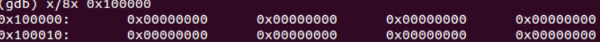
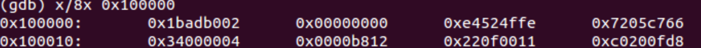

# Exercise 6

在这个练习中，我们将尝试使用GDB的x命令（查看内存命令）。 x/Nx ADDR。这个指令将打印出从ADDR地址开始之后的N个字的内容。重启一下Qemu。在Bios进入boot loader之前，内存地址0x00100000处8个字的内容，然后进入boot loader运行到内核开始处停止，再看下这个地址处的值。为什么二者不同？第二次这个内存处所存放的值的含义是什么？

在进入boot loader之前，从内存地址0x00100000处开始之后8个字的内容为：

　　　　

在进入kernel那一刻之前，从内存地址0x00100000处开始之后8个字的内容为：

   为什么会产生这种变化，因为bootmain函数在最后会把内核的各个程序段送入到内存地址0x00100000处，所以这里现在存放的就是内核的某一个段的内容，由于程序入口地址是0x0010000C，正好位于这个段中，所以可以推测，这里面存放的应该是指令段，即.text段的内容。

