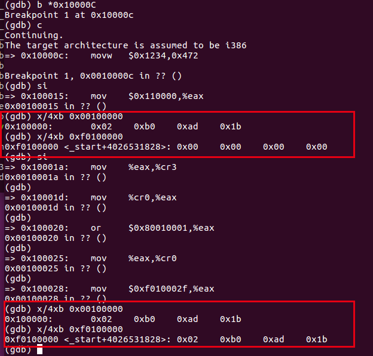
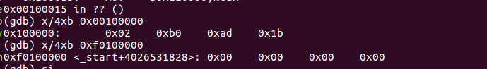
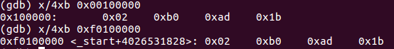
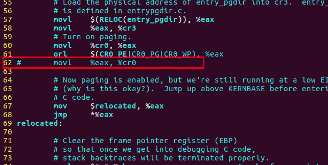
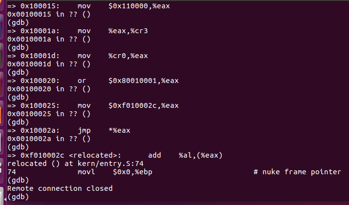
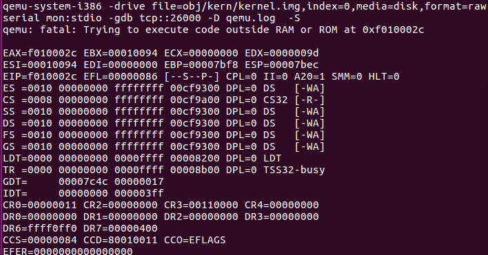

# Exercise 7

使用 QEMU 和 GDB 跟踪到 JOS 内核并在`movl %eax, %cr0`. 检查 0x00100000 和 0xf0100000 处的内存。stepi现在，使用GDB 命令单步执行该指令。再次检查 0x00100000 和 0xf0100000 处的内存。确保您了解刚刚发生的事情。

*建立新映射后*，如果映射没有到位，将无法正常工作 的第一条指令是什么？注释掉`kern/entry.S 中``movl %eax, %cr0`的 内容，追踪它，看看你是否正确。

　我们可以首先设置断点到0x10000C处，因为我们在之前的练习中已经知道了，0x10000C是内核文件的入口地址。 然后我们从这条指令开始一步步运行，直到碰到movl %eax, %cr0指令。在这条指令运行之前，地址0x00100000和地址0xf0100000两处存储的内容是：

​		可见当前这两地址处的值是不一样的。

　　然后输入stepi命令（其实就是si命令），再查看两个位置：

我们会发现两处存放的值已经一样了！ 可见原本存放在0xf0100000处的内容，已经被映射到0x00100000处了。

第二问需要我们把kern/entry.S文件中的%movl %eax, %cr0这句话注释掉，重新编译内核。我们需要先make clean，然后把%movl %eax, %cr0这句话注释掉，重新编译。 再次用qemu仿真，并且设置断点到0x10000C处，开始一步步执行。通过一步步查询发现了出现错误的一句。

其中在0x10002a处的jmp指令，要跳转的位置是0xf010002C，由于没有进行分页管理，此时不会进行虚拟地址到物理地址的转化。所以报出错误，下面是make qemu-gdb这个窗口中出现的信息。

可见你当前访问的逻辑地址超出内存了。