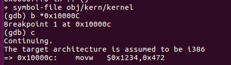
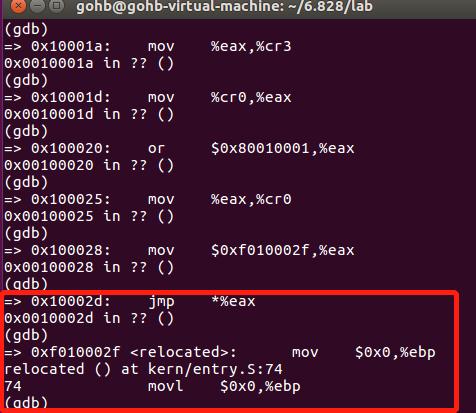
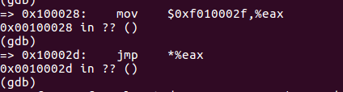

# Exercise 9

　**判断一下操作系统内核是从哪条指令开始初始化它的堆栈空间的，以及这个堆栈坐落在内存的哪个地方？内核是如何给它的堆栈保留一块内存空间的？堆栈指针又是指向这块被保留的区域的哪一端的呢？**

**答：**

　　**1.** **首先需要判断操作系统内核是从哪条指令开始初始化它的堆栈空间的。**

　　前面已经分析过boot.S和main.c文件的运行过程，这个文件中的代码是PC启动后，BIOS运行完成后，首先执行的两部分代码。但是它们并不属于操作系统的内核。当main.c文件中的bootmain函数运行到最后时，它执行的最后一条指令就是跳转到entry.S文件中的entry地址处。此时控制权已经被转交给了entry.S。

　　在跳转到entry之前，并没有对%esp，%ebp寄存器的内容进行修改，可见在bootmain中并没有初始化堆栈空间的语句。

　　下面进入entry.S，在entry.S中我们可以看到它最后一条指令是要调用i386_init()子程序。这个子程序位于init.c文件之中。在这个程序中已经开始对操作系统进行一些初始化工作，并且自重进入mointor函数。可见到i386_init子程序时，内核的堆栈应该已经设置好了。**所以设置内核堆栈的指令就应该是entry.S中位于 call i386_init 指令之前的两条语句：**

```assembly
　movl    $0x0,%ebp            # nuke frame pointer
　movl    $(bootstacktop),%esp
```

　这两条指令修改了%ebp，%esp两个寄存器的值，而这两个寄存器的值是和堆栈息息相关的。

　

　　**2. 这个堆栈坐落在内存的什么地方？**

　　解答这个问题就需要我们好好分析一下entry.S文件了。最好的方法自然是阅读其源码，并且也要配合反汇编文件。



　当我们准备运行entry.S中第一条指令 movx $0x1234, 0x472 时，指令地址是0x10000C，如上图所示。这个比较好理解，因为在bootmain里面，我们已经把操作系统的内核文件全部加载到物理内存0x100000处了。所以0x10000C是系统内核的第一条指令所在的物理地址处。

　　而当我们继续运行运行到jmp *%eax之后，后面的指令地址就都变化了，变换为：



　图中的地址是0xf010002f，很明显这是一个虚拟地址，它的真实地址应该是0x0010002f，因为所有的内核代码都实际存放在这个内存区域中。之所以现在要把指令地址设置为0xf010002f，即把操作系统的代码的虚拟地址设置为从0xf0100000开始。目的就是能够让程序员在编程时，能够利用虚拟地址空间的低地址空间。如果它编写的程序调用了操作系统的代码，则操作系统代码的虚拟地址一定位于高地址空间0xf0100000处。这样非常有利于程序员写程序。

所以必须有一种机制能够实现，即便程序员在程序中指定的操作系统的代码的虚拟地址在0xf0100000高地址空间，但是我们这个机制也能够把这个高地址转换为这个代码真实的在内存中的位置。比如上图中，我们想访问0xf010002f处的指令，这是个虚拟地址，当实际运行时，会有一种机制把这个地址转换为真实地址0x0010002f。

　在entry.S文件中，下面的这些代码是来实现这个机制的：

```assembly
1 　　movl    $(RELOC(entry_pgdir)), %eax
2 　　movl    %eax, %cr3
3 　　movl    %cr0, %eax
4 　　orl    $(CR0_PE|CR0_PG|CR0_WP), %eax
5 　　movl    %eax, %cr0
```

这个机制的实现方式是通过写了一个c语言的页表，entry_pgdir，这个手写的页表可以自动的把[0xf0000000-0xf0400000]这4MB的虚拟地址空间映射为[0x00000000-0x00400000]的物理地址空间。可见这个页表的映射能力还是比较有限的，只能映射一个区域。对于当前执行的这些指令，这个映射空间就已经足够了。因为当前运行的是内核程序，他们的虚拟空间地址范围在[0xf0000000-0xf0400000]之内。但是当操作系统真正正常的运行起来的时候，这个映射就不够用了。必须采用更全面的，也就是在lab 2中要介绍的页表机制。所以当操作系统真正正常运行起来时，entry_pgdir这个页表将不会再使用。

　　现在依次分析上述语句，首先看**第1句，它的功能是把entry_pgdir这个页表的起始物理地址送给%eax**，这里RELOC宏的功能是计算输入参数的物理地址。

　　**第2句，把entry_pgdir这个页表的起始地址传送给寄存器%cr3。**

　　控制寄存器cr2和cr3都是和分页机制相关的寄存器。其中cr3寄存器存放页表的物理起始地址。

　　**第3~5句，修改cr0寄存器的值，把cr0的PE位，PG位, WP位都置位1。其中PE位是启用保护标识位，如果被置1代表将会运行在保护模式下。PG位是分页标识位，如果这一位被置1，则代表开启了分页机制。WP位是写保护标识，如果被置位为1，则处理器会禁止超级用户程序向用户级只读页面执行写操作。**

　　这条指令过后，就开始工作在具有分页机制的模式之下了。接下来的指令就可以指定[0xf0000000-0xf0400000]范围的指令了。

　 然后下面两条指令就把当前运行程序的地址空间提高到[0xf0000000-0xf0400000]范围内。

```assembly
1     mov    $relocated, %eax
2     jmp    *%eax
```

其中在实际调试时，这两条指令如下：



可见relocated的值为0xf010002f。此时分页系统会把这个虚拟地址，转换为真实的物理地址。


**接下来就到了最关键的两句指令：**

```assembly
1     movl    $0x0,%ebp            # nuke frame pointer
2     movl    $(bootstacktop),%esp
3     call    i386_init
```

　这两个指令分别设置了%ebp，%esp两个寄存器的值。其中%ebp被修改为0。%esp则被修改为bootstacktop的值。这个值为0xf0110000。另外在entry.S的末尾还定义了一个值，bootstack。注意，在数据段中定义栈顶bootstacktop之前，首先分配了KSTKSIZE这么多的存储空间，专门用于堆栈，这个KSTKSIZE = 8 * PGSIZE = 8 * 4096 = 32KB。**所以用于堆栈的地址空间为 0xf0108000-0xf0110000，其中栈顶指针指向0xf0110000. 那么这个堆栈实际坐落在内存的 0x00108000-0x00110000物理地址空间中。**

  **3.** **内核是如何给它的堆栈保留一块内存空间的？**

　 其实就是通过刚刚分析的，在entry.S中的数据段里面声明一块大小为32Kb的空间作为堆栈使用。从而为内核保留了一块空间。

　

　　**4.** **堆栈指针又是指向这块被保留的区域的哪一端的呢？**

　　堆栈由于是向下生长的，所以堆栈指针自然要指向最高地址了。最高地址就是我们之前看到的bootstacktop的值。所以将会把这个值赋给堆栈指针寄存器。