实验分为三个部分：

- 熟悉汇编语言、QEMU x86模拟器、PC上电启动过程
- 检查我们的6.828内核的boot loader程序，它位于`lab`的`boot`目录下。
- 深入研究6.828内核本身的初始模板，位于`kernel`目录下。

# PART1: PC Bootstrap

```shell
gohb@gohb-virtual-machine:~$ mkdir ~/6.828
gohb@gohb-virtual-machine:~$ cd 6.828/
gohb@gohb-virtual-machine:~/6.828$ git clone https://pdos.csail.mit.edu/6.828/2018/jos.git lab
```

编译代码

```
gohb@gohb-virtual-machine:~/6.828/lab$ make
```

如果看到

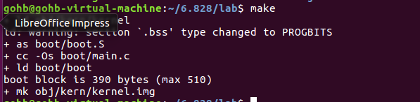

就说明编译成功了。

```
gohb@gohb-virtual-machine:~/6.828/lab$ make qemu
```


#### PC的物理地址空间

PC 的物理地址空间是硬连线的，具有以下一般布局：

```

+------------------+  <- 0xFFFFFFFF (4GB)
|      32-bit      |
|  memory mapped   |
|     devices      |
|                  |
/\/\/\/\/\/\/\/\/\/\

/\/\/\/\/\/\/\/\/\/\
|                  |
|      Unused      |
|                  |
+------------------+  <- depends on amount of RAM
|                  |
|                  |
| Extended Memory  |
|                  |
|                  |
+------------------+  <- 0x00100000 (1MB)
|     BIOS ROM     |
+------------------+  <- 0x000F0000 (960KB)
|  16-bit devices, |
|  expansion ROMs  |
+------------------+  <- 0x000C0000 (768KB)
|   VGA Display    |
+------------------+  <- 0x000A0000 (640KB)
|                  |
|    Low Memory    |
|                  |
+------------------+  <- 0x00000000
```

基于 16 位 Intel 8088 处理器的第一台 PC 只能处理 1MB的物理内存。因此，早期 PC的物理地址空间将从 0x00000000 开发，但以 0x000FFFFF 而不是 0xFFFFFFFF 结束。 标有 “Low Memory” 的 640KB区域是早期 PC 可以使用的唯一随机存取存储器（RAM）；事实上，最早的 PC 只能配置 16KB, 32KB 或者 64KB 的 RAM。

从 0x000A0000 到 0x000FFFFF 的 384KB 区域 由硬件保留用于特殊用途，例如视频显示缓冲区和保存在非易失性存储器中的固件。这个保留区域中最重要的部分是 基本输入/输出系统（BIOS），它占据了从 0x000F0000 到 0x000FFFFF 的 64KB 区域。在早期的PC中，BIOS 保存在真正的只读存储器（ROM）中，但当前的 PC 将 BIOS 存储在可更新的闪存中。BIOS 负责执行基本的系统初始化，例如激活显卡和检查安装的内存量。执行完初始化后，BIOS 从软盘、硬盘、CD-ROM 或网络等适当位置加载操作系统，并将机器的控制权交给操作系统。

当 Intel 最终用 80286 和 80386 处理器“打破 1MB 障碍”，分别支持 16MB 和 4GB 物理地址空间时，PC 架构师仍然保留了低 1MB 物理地址空间的原始布局，以确保向后兼容现有软件。因此，现代 PC 在物理内存中从 0x000A0000 到 0x00100000 有一个“洞”，将 RAM 分为“低”或“常规内存”（前 640KB）和“扩展内存”（其他所有内存）。此外，PC 的 32 位物理地址空间最顶端的一些空间，尤其是物理 RAM，现在通常由 BIOS 保留，供 32 位 PCI 设备使用。

最近的 x86 处理器可以支持 *超过*4GB 的物理 RAM，因此 RAM 可以进一步扩展到 0xFFFFFFFF 以上。在这种情况下，BIOS 必须安排在系统 RAM 中的 32 位可寻址区域顶部留出*第二个孔，以便为这些 32 位设备的映射留出空间。*由于设计限制，JOS 无论如何都只会使用 PC 的前 256MB 物理内存，所以现在我们假设所有 PC “只有”一个 32 位物理地址空间。但是处理复杂的物理地址空间和多年来演变的硬件组织的其他方面是操作系统开发的重要实际挑战之一。

#### ROM BIOS

打开两个终端窗口和两个 shell。在一个中，输入make qemu-gdb（或make qemu-nox-gdb）。这会启动 QEMU，但 QEMU 在处理器执行第一条指令之前停止并等待来自 GDB 的调试连接。在第二个终端中，从您运行`make`的同一目录中运行make gdb。

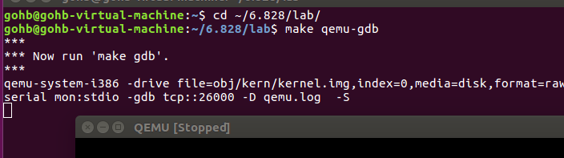

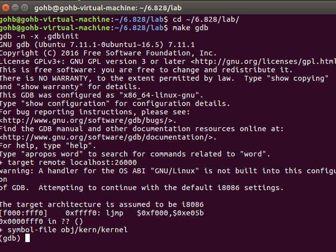


# PART 2: The Boot Loader

PC 的软盘和硬盘被划分为 512 byte的区域，称为扇区。扇区是磁盘的最小传输粒度：每次读取或写入操作的大小必须是一个或多个扇区，并且在扇区边界上对齐。如果磁盘是可引导的，则第一个扇区被称为 引导扇区，因为这是引导加载程序代码所在的位置。当 BIOS 找到可引导的软盘或硬盘时，它会将 512 字节的引导扇区加载到物理地址 0x7c00 到 0x7dff 的内存中，然后使用`jmp`指令将 CS:IP 设置为`0000:7c00`，将控制权交给引导装载机。与 BIOS 加载地址一样，这些地址是相当随意的——但它们对于 PC 来说是固定的和标准化的。

从 CD-ROM 启动的能力在 PC 的发展过程中出现得晚得多，因此 PC 架构师借此机会稍微重新考虑了启动过程。因此，现代 BIOS 从 CD-ROM 引导的方式有点复杂（而且功能更强大）。CD-ROM 使用 2048 字节而不是 512 字节的扇区大小，并且 BIOS 可以在将控制权转移到内存之前将更大的引导映像从磁盘加载到内存中（不仅仅是一个扇区）。有关详细信息，请参阅[“El Torito”可引导 CD-ROM 格式规范](https://pdos.csail.mit.edu/6.828/2018/readings/boot-cdrom.pdf)。

然而，对于 6.828，我们将使用传统的硬盘引导机制，这意味着我们的引导加载程序必须适合区区的 512 字节。引导加载程序由一个汇编语言源文件`boot/boot.S`和一个 C 源文件`boot/main.c` 组成，仔细查看这些源文件并确保您了解发生了什么。引导加载程序必须执行两个主要功能：

1. 首先，boot loader将处理器从实模式切换到 32位 保护模式，因为只有在这种模式下，软件才能访问处理器物理地址空间中 1MB 以上的内存。
2. 然后，boot loader通过 x86 特殊的 I/O指令直接访问IDE磁盘设备寄存器，从硬盘读取内核。

对于boot loader来说，有一个文件很重要。obj/boot/boot.asm。。该文件是我们的 GNUmakefile*在*编译引导加载程序后创建的引导加载程序的反汇编。这个反汇编文件可以很容易地查看所有引导加载程序的代码在物理内存中的确切位置，并且可以更容易地跟踪在 GDB 中单步执行引导加载程序时发生的情况。同样，`obj/kern/kernel.asm`包含 JOS 内核的反汇编，它通常对调试很有用。

```
下面回答一下文中提出的四个问题：

 　1. 在什么时候处理器开始运行于32bit模式？到底是什么把CPU从16位切换为32位工作模式？

　答：在boot.S文件中，计算机首先工作于实模式，此时是16bit工作模式。当运行完 " ljmp $PROT_MODE_CSEG, $protcseg " 语句后，正式进入32位工作模式。根本原因是此时CPU工作在保护模式下。

 　2. boot loader中执行的最后一条语句是什么？内核被加载到内存后执行的第一条语句又是什么？

　答：boot loader执行的最后一条语句是bootmain子程序中的最后一条语句 " ((void (*)(void)) (ELFHDR->e_entry))(); "，即跳转到操作系统内核程序的起始指令处。

　　  这个第一条指令位于/kern/entry.S文件中，第一句 movw $0x1234, 0x472

  \3. 内核的第一条指令在哪里？

　答：上一个问题中已经回答过这个问题，第一条指令位于/kern/entry.S文件中。

 　4. boot loader是如何知道它要读取多少个扇区才能把整个内核都送入内存的呢？在哪里找到这些信息？

　答：首先关于操作系统一共有多少个段，每个段又有多少个扇区的信息位于操作系统文件中的Program Header Table中。这个表中的每个表项分别对应操作系统的一个段。并且每个表项的内容包括这个段的大小，段起始地址偏移等等信息。所以如果我们能够找到这个表，那么就能够通过表项所提供的信息来确定内核占用多少个扇区。

　　　那么关于这个表存放在哪里的信息，则是存放在操作系统内核映像文件的ELF头部信息中。
```


### Loading the Kernel

要理解`boot/main.c` ，您需要知道 ELF 二进制文件是什么。当您编译和链接诸如 JOS 内核之类的 C 程序时，编译器会将每个 C 源 (' `.c` ') 文件转换为一个*对象*(' `.o` ') 文件，其中包含以硬件期望的二进制格式编码的汇编语言指令. 然后，链接器将所有编译的目标文件组合成一个*二进制映像*，例如`obj/kern/kernel`，在这种情况下，它是 ELF 格式的二进制文件，代表“可执行和可链接格式”。

有关此格式的完整信息可在 我们[的参考页面上](https://pdos.csail.mit.edu/6.828/2018/reference.html)[的 ELF 规范](https://pdos.csail.mit.edu/6.828/2018/readings/elf.pdf)中找到，但您无需在本课程中深入研究此格式的详细信息。虽然整体上这个格式相当强大和复杂，但是大部分复杂的部分都是为了支持共享库的动态加载，我们在这个类中不会做。维基[百科页面](http://en.wikipedia.org/wiki/Executable_and_Linkable_Format)有一个简短的描述。

出于 6.828 的目的，您可以将 ELF 可执行文件视为带有加载信息的标头，后跟几个*程序部分*，每个部分都是连续的代码或数据块，旨在加载到指定地址的内存中。引导加载程序不会修改代码或数据；它将它加载到内存中并开始执行它。

ELF 二进制文件以一个固定长度的*ELF 标头*开始，然后是一个可变长度的*程序标头* ，其中列出了要加载的每个程序部分。这些 ELF 标头的 C 定义位于`inc/elf.h 中`。我们感兴趣的程序部分是：

- `.text`：程序的可执行指令。
- `.rodata`：只读数据，例如由 C 编译器生成的 ASCII 字符串常量。（不过，我们不会费心设置硬件来禁止写入。）
- `.data`：数据部分保存程序的初始化数据，例如使用`int x = 5 等初始化器声明的全局变量；`

　当链接器在计算整个程序的内存布局时，它会为没有被初始化过的变量，比如int x;，在一个紧跟在.data段后的段，.bss段中保留它们的信息。C语言要求所有没有被初始化的变量值都为0。因而我们并不需要在ELF文件中存放这些变量的值，因为一定是0。因此链接器只是把这些变量的地址和大小存放在.bss段中。只有当程序装入内存后，由装入器为这些段赋予初值0。

​	你可以通过下面的指令来考察JOS内核中所有段的名字，大小和地址。

```
gohb@gohb-virtual-machine:~/6.828/lab$ objdump -h obj/kern/kernel
```

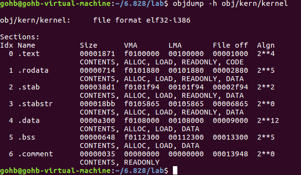

在每一个段中都有两个比较重要的字段，VMA(链接地址)，LMA(加载地址)。其中加载地址代表的就是这个段被加载到内存中后，它所在的物理地址。链接地址则指的是这个段希望被存放到的逻辑地址。

每一个ELF文件中都有一个Program Headers Table，用于指明ELF文件中哪些部分被加载到内存，以及被加载到内存中的地址。你可以通过输入下述指令来获取kernel的Program Headers Table的信息：

```
gohb@gohb-virtual-machine:~/6.828/lab$ objdump -x obj/kern/kernel
```

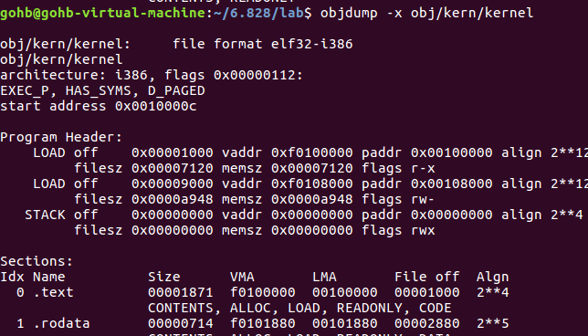

其中Program Header中列出的是所有被加载到内存中的段的信息，这也是Program Headers Table的表项。每一个表项图中都把这个表项中涉及到的所有字段都列出来了。可见有一些段最后没有被加入到内存之中。在上图中，那些需要被加载到内存的段被标记为LOAD。   

　　BIOS通常会把boot sector加载到内存地址0x7c00处，这是boot sector的加载地址，也是boot sector的链接地址。我们可以通过boot/Makefrag文件中的-Ttext 0x7c00语句设置boot sector的链接地址，并且这个链接地址后来会被链接器所使用，保证链接器产生正确的代码。


内核的加载地址和链接地址。和boot loader不同，内核的这两个地址是不同的。内核告诉boot loader把它加载到低地址处（加载地址），但是它希望运行在高地址处（链接地址）。我们将在下一章仔细看这个问题。

　　除了各个段的信息，在ELF头部中，还有一个非常重要的信息就是e_entry字段。这个字段存放的是这个可执行程序的执行入口处的链接地址。通过下面的指令你可以查看内核程序入口处。

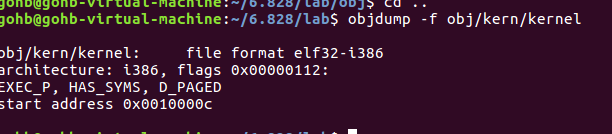

 可见程序入口地址为0x0010000C，这个地址也和我们之前的分析相符合。


# Part 3 : The kernel

现在我们将开始具体讨论一下JOS内核了。就像boot loader一样，内核开始的时候也是一些汇编语句，用于设置一些东西，来保证C语言的程序能够正确的执行。

### 使用虚拟内存

　　在运行boot loader时，boot loader中的链接地址（虚拟地址）和加载地址（物理地址）是一样的。但是当进入到内核程序后，这两种地址就不再相同了。（链接内核比引导加载程序更复杂，所以链接和加载地址在`kern/kernel.ld`的顶部。）

　　操作系统内核程序在虚拟地址空间通常会被链接到一个非常高的虚拟地址空间处，比如0xf0100000，目的就是能够让处理器的虚拟地址空间的低地址部分能够被用户利用来进行编程。

　　但是许多的机器其实并没有能够支持0xf0100000这种地址那么大的物理内存，所以我们不能把内核的0xf0100000虚拟地址映射到物理地址0xf0100000的存储单元处。

　　这就造成了一个问题，在我们编程时，我们应该把操作系统放在高地址处，但是在实际的计算机内存中却没有那么高的地址，这该怎么办？

　　解决方案就是在虚拟地址空间中，我们还是把操作系统放在高地址处0xf0100000，但是在实际的内存中我们把操作系统存放在一个低的物理地址空间处，如0x00100000。那么当用户程序想访问一个操作系统内核的指令时，首先给出的是一个高的虚拟地址，然后计算机中通过某个机构把这个虚拟地址映射为真实的物理地址，这样就解决了上述的问题。那么这种机构通常是通过分段管理，分页管理来实现的。

　　在这个实验中，首先是采用分页管理的方法来实现上面所讲述的地址映射。但是设计者实现映射的方式并不是通常计算机所采用的分页管理机构，而是自己手写了一个程序**lab\kern\entrygdir.c**用于进行映射。既然是手写的，所以它的功能就很有限了，只能够把虚拟地址空间的地址范围：0xf0000000~0xf0400000，映射到物理地址范围：0x00000000~0x00400000上面。也可以把虚拟地址范围：0x00000000~0x00400000，同样映射到物理地址范围：0x00000000~0x00400000上面。任何不再这两个虚拟地址范围内的地址都会引起一个硬件异常。虽然只能映射这两块很小的空间，但是已经足够刚启动程序的时候来使用了。

### 格式化打印到控制台

大多数人认为像`printf()`这样的函数是理所当然的，有时甚至认为它们是 C 语言的“原语”。但是在操作系统内核中，我们必须自己实现所有 I/O。

通读`kern/printf.c`、`lib/printfmt.c`和`kern/console.c`，并确保您了解它们的关系。


 回答下试验报告中Exercise 8后面的问题：

　 **1. 解释一下printf.c和console.c两个之间的关系。console.c输出了哪些子函数？这些子函数是怎么被printf.c所利用的？**

　 答：在Exercise 8的解答中我们已经很具体的分析了两个文件，在console.c中除了被static修饰符修饰的函数之外，都可以被外部所使用，其中被printf所使用的函数就是cputchar子函数。

　 **2. 解释一下console.c文件中，下面这段代码的含义：**

```
if (crt_pos >= CRT_SIZE) {
       int i;
       memcpy(crt_buf, crt_buf + CRT_COLS, (CRT_SIZE - CRT_COLS) * sizeof(uint16_t));
       for (i = CRT_SIZE - CRT_COLS; i < CRT_SIZE; i++)
               crt_buf[i] = 0x0700 | ' ';
       crt_pos -= CRT_COLS;
}
```

　 答：首先看下里面的几个变量：

　　　 crt_buf:这是一个字符数组缓冲区，里面存放着要显示到屏幕上的字符

　　　 crt_pos:这个表示当前最后一个字符显示在屏幕上的位置，在介绍这个变量前我们还要知道一些知识，这是我在网上自己查询的。

　　  早期的计算机如果想显示信息给用户只能通过文字模式，比如当你现在打开电脑时，进入桌面之前，所有的信息都是通过文字显示在屏幕上的。那么这种模式就叫做文字模式，那么这个console.c源程序中考虑的就是一种非常常见的文字模式，80x25文字模式，即整个屏幕上允许显示最多25行字符，每行最多显示80个字符。所以一共代表了80x25个位置。当我们要显示某个特定字符到屏幕某个位置上面时，我们必须要指定显示的位置，和显示字符给屏幕驱动器cga。

　　　 而在console.c文件中，子程序cga_putc(int c)就是完成这项功能，把字符c显示到屏幕当前显示的下一个位置。比如当前屏幕中已经显示了三行数据(0号行，1号行，2号行)，并且第三行已经显示了40个字符，此时执行cga_putc(0x65)，那么就会把0x65对应的字符'A'显示到2号行第41个字符处。所以cga_putc需要两个变量，crt_buf，这个一个字符数组指针，该字符数组就是当前显示在屏幕上的所有字符。crt_pos则表示下一个要显示的字符存放在数组中的位置，其实通过这个值也可以推导出它显示在屏幕上的位置。比如crt_pos = 85，那么它就应该显示在第2行（即1号行），第6字符（5号字符）处。所以crt_pos的取值范围应该是从0~(80*25-1)。

　　　 上面题目中要分析的这段代码位于cga_putc中，cga_putc的分为三部分，第一部分是根据字符值int c来判断到底要显示成什么样子。而第二部分就是上述代码。第三部分则是把你决定要显示的字符显示到屏幕的指定位置上。咱们具体分析第二部分，

　　　 当crt_pos >= CRT_SIZE，其中CRT_SIZE = 80*25，由于我们知道crt_pos取值范围是0~(80*25-1)，那么这个条件如果成立则说明现在在屏幕上输出的内容已经超过了一页。所以此时要把页面向上滚动一行，即把原来的1~79号行放到现在的0~78行上，然后把79号行换成一行空格（当然并非完全都是空格，0号字符上要显示你输入的字符int c）。所以memcpy操作就是把crt_buf字符数组中1~79号行的内容复制到0~78号行的位置上。而紧接着的for循环则是把最后一行，79号行都变成空格。最后还要修改一下crt_pos的值。

**3. 观察下面的一串代码：**

```c
int x = 1, y = 3, z = 4;
cprintf("x %d, y %x, z %d\n", x, y, z);
```

　**回答下列问题：**

　　　　*** 当调用cprintf时，fmt指向的是什么内容，ap指向的是什么内容。**

　　　　*** 按照执行的顺序列出所有对cons_putc, va_arg，和vcprintf的调用。对于cons_putc，列出它所有的输入参数。对于va_arg列出ap在执行完这个函数后的和执行之前的变化。对于vcprintf列出它的两个输入参数的值。**

答：

　　观察cprintf函数：

```c
1 int
 2 cprintf(const char *fmt, ...)
 3 {
 4     va_list ap;
 5     int cnt;
 6 
 7     va_start(ap, fmt);
 8     cnt = vcprintf(fmt, ap);
 9     va_end(ap);
10 
11     return cnt;
12 }
```

　回答第一个问题，首先fmt自然指向的是显示信息的格式字符串，那么在这段代码中，它指向的就是"x %d, y %x, z %d\n"字符串。而ap是va_list类型的。我们之前已经介绍过，这个类型专门用来处理输入参数的个数是可变的情况。所以ap会指向所有输入参数的集合。

　　继续观察，发现cprint中调用了vcprintf函数，并且把格式字符串fmt，所有的参数列表ap（包含x,y,z）作为输入参数传给了vcprintf，然后vcprintf调用在\lib\printfmt.c中的vprintfmt子程序，并且传递给它4个参数。第1个参数是一个显示字符的子程序：这里采用的是printf.c文件中自己定义的putch函数。这个函数可以把字符显示到屏幕上。然后在传递一个值为0的变量的引用给第2个参数。原本第2个参数的含义是一个内存地址，并且第1个参数函数指针所指向的函数应该能够把字符写入到第2个参数所指定的地址处。但是由于我们的第1个参数是显示数据到屏幕。所以这里不需要第2个参数了。所以此时我们把一个变量引用作为第2个参数，是把它当做计数器，记录显示了多少字符。第3,4字符的含义没有变，和cprintf的参数一样。

　　然后进入vprintfmt子程序。这个子程序我们已经分析过。这里就不再赘述了。这个子程序的工作过程就是，不停的分析格式字符串fmt。分析采取的方式是把格式字符串划分成多个部分，每个部分都至多带有一个待显示的参数，比如我们这道题中的格式字符串就可以被划分为4个部分：

　　"x %d"， ", y %x" , ", z %d", "\n"

　　然后先分析每个部分中%号前面的字符串，并且直接输出。比如"x %d"中"x "。然后分析%号后面的内容，比如"x %d"中分析的结果就是要按照10进制显示一个参数。每当分析完%号后面的内容，程序就会按照分析的结果来进行不同的操作。在分析完"x %d"后，代码开始执行下面这个分支：

```c
case 'd':
            num = getint(&ap, lflag);                        //根据你的整数类型到底是int，还是long，还是long long，从参数列表ap中取出相应类型的参数
            if ((long long) num < 0) {                        //如果输入参数是负数，先输出一个负号
                putch('-', putdat);
                num = -(long long) num;
            }
            base = 10;
            goto number;case 'd':
            num = getint(&ap, lflag);                        //根据你的整数类型到底是int，还是long，还是long long，从参数列表ap中取出相应类型的参数
            if ((long long) num < 0) {                        //如果输入参数是负数，先输出一个负号
                putch('-', putdat);
                num = -(long long) num;
            }
            base = 10;
            goto number;
```

这个分支中首先是一个子函数getint，这个子函数的内容如下：

```c
static long long
getint(va_list *ap, int lflag)
{
    if (lflag >= 2)
        return va_arg(*ap, long long);
    else if (lflag)
        return va_arg(*ap, long);
    else
        return va_arg(*ap, int);
}
```

　可见它是根据不同的参数类型，利用va_arg方法从ap参数列表中取出下一个参数，在我们的例子中会执行第9行的代码。这里对va_arg进行了一次调用，调用前ap中包括x，y，z三个参数的内容：1，3，4。调用完成后只剩下y，z的内容：3,4.

　　回到vprintfmt，现在num中存放的是待显示的值1。下一步先判断这个待显示的值是否是负数，如果是负数应该先调用putch函数，显示一个负号在屏幕上。之后跳转到number处。

　　number处是一个子程序 printnum(putch, putdat, num, base, width, padc)，这个子程序会按照指定的进制，以及格式显示你刚刚取到的参数1。在这个子程序中我们可以看到它会把你取到的参数值（num = 1）按照你所指定的进制（base = 10），一位一位的显示出来。所以每得到一位的值它都会调用一次putch，把它显示到屏幕上。另外这句代码putch(padc, putdat);是为了实现当显示需要右对齐时，应该先把左边补上空格。

　　所以这样第1个参数x=1就是显示在屏幕上了，后面的两个也是同样的道理。

　　为了能够真实的运行这段代码，我们可以找到\lab\kern\monitor.c文件，用vim编辑它，把这两句指令加在monitor子程序中，如下：

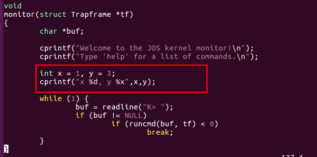


重新编译整个内核，然后在lab目录下运行 make qemu 指令，就会打印出结果了：

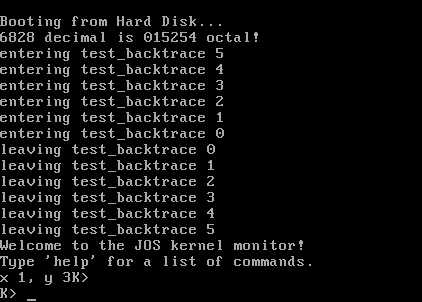

**4. 运行下面的代码：**

```c
 unsigned int i = 0x00646c72;
 cprintf("H%x Wo%s", 57616, &i);
```

**输出是什么？解释一下为什么是这样的输出？**

　　　答：

　　　　首先，我们还是采用和上一题一样的方法，把这两句代码加到moniter.c文件中。并且最后得到的运行结果如下：

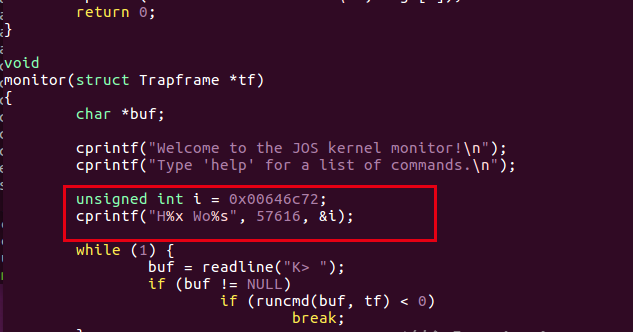

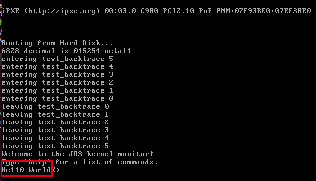

　为什么会输出这样的值，首先看下第一个%x，指的是要按照16进制输出第一个参数，第一个参数的值是57616，它对应的16进制的表示形式为e110，所以前面就变成的He110。

　　　　然后看下一个%s，输出参数所指向的字符串。参数是&i，是变量i的地址，所以应该输出的是变量i所在地址处的字符串。

　　　　而在cprintf之前我们把i定义为一个int类型变量，所以现在我们要把它们进行拆分，按照一个字节一个字节来进行输出。

　　　　由于x86是小端模式，代表字的最高位字节存放在最高位字节地址上。假设i变量的地址为0x00，那么i的4个字节的值存放在0x00，0x01，0x02，0x03四处。由于是小端存储，所以0x00处存放0x72('r')，0x01处存放0x6c('l')，0x02处存放0x64('d')，0x03处存放0x00('\0').

　　　　所以在cprintf将会从i的地址开始一个字节一个字节遍历，正好输出 "World"

　　**5. 看下面的代码，在'y='后面会输出什么？为什么会这样？**

答：

　　　　输出的结果如下

```c
cprintf("x=%d y=%d", 3);
```

　　由于y并没有参数被指定，所以会输出一个不确定的值。


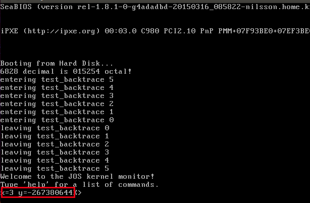
