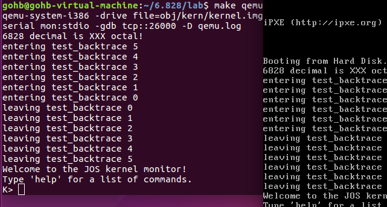

实验分为三个部分：

- 熟悉汇编语言、QEMU x86模拟器、PC上电启动过程
- 检查我们的6.828内核的boot loader程序，它位于`lab`的`boot`目录下。
- 深入研究6.828内核本身的初始模板，位于`kernel`目录下。

# PART1: PC Bootstrap

```shell
gohb@gohb-virtual-machine:~$ mkdir ~/6.828
gohb@gohb-virtual-machine:~$ cd 6.828/
gohb@gohb-virtual-machine:~/6.828$ git clone https://pdos.csail.mit.edu/6.828/2018/jos.git lab
```

编译代码

```
gohb@gohb-virtual-machine:~/6.828/lab$ make
```

如果看到


就说明编译成功了。

```
gohb@gohb-virtual-machine:~/6.828/lab$ make qemu
```



#### PC的物理地址空间

PC 的物理地址空间是硬连线的，具有以下一般布局：

```

+------------------+  <- 0xFFFFFFFF (4GB)
|      32-bit      |
|  memory mapped   |
|     devices      |
|                  |
/\/\/\/\/\/\/\/\/\/\

/\/\/\/\/\/\/\/\/\/\
|                  |
|      Unused      |
|                  |
+------------------+  <- depends on amount of RAM
|                  |
|                  |
| Extended Memory  |
|                  |
|                  |
+------------------+  <- 0x00100000 (1MB)
|     BIOS ROM     |
+------------------+  <- 0x000F0000 (960KB)
|  16-bit devices, |
|  expansion ROMs  |
+------------------+  <- 0x000C0000 (768KB)
|   VGA Display    |
+------------------+  <- 0x000A0000 (640KB)
|                  |
|    Low Memory    |
|                  |
+------------------+  <- 0x00000000
```

基于 16 位 Intel 8088 处理器的第一台 PC 只能处理 1MB的物理内存。因此，早期 PC的物理地址空间将从 0x00000000 开发，但以 0x000FFFFF 而不是 0xFFFFFFFF 结束。 标有 “Low Memory” 的 640KB区域是早期 PC 可以使用的唯一随机存取存储器（RAM）；事实上，最早的 PC 只能配置 16KB, 32KB 或者 64KB 的 RAM。

从 0x000A0000 到 0x000FFFFF 的 384KB 区域 由硬件保留用于特殊用途，例如视频显示缓冲区和保存在非易失性存储器中的固件。这个保留区域中最重要的部分是 基本输入/输出系统（BIOS），它占据了从 0x000F0000 到 0x000FFFFF 的 64KB 区域。在早期的PC中，BIOS 保存在真正的只读存储器（ROM）中，但当前的 PC 将 BIOS 存储在可更新的闪存中。BIOS 负责执行基本的系统初始化，例如激活显卡和检查安装的内存量。执行完初始化后，BIOS 从软盘、硬盘、CD-ROM 或网络等适当位置加载操作系统，并将机器的控制权交给操作系统。

当 Intel 最终用 80286 和 80386 处理器“打破 1MB 障碍”，分别支持 16MB 和 4GB 物理地址空间时，PC 架构师仍然保留了低 1MB 物理地址空间的原始布局，以确保向后兼容现有软件。因此，现代 PC 在物理内存中从 0x000A0000 到 0x00100000 有一个“洞”，将 RAM 分为“低”或“常规内存”（前 640KB）和“扩展内存”（其他所有内存）。此外，PC 的 32 位物理地址空间最顶端的一些空间，尤其是物理 RAM，现在通常由 BIOS 保留，供 32 位 PCI 设备使用。

最近的 x86 处理器可以支持 *超过*4GB 的物理 RAM，因此 RAM 可以进一步扩展到 0xFFFFFFFF 以上。在这种情况下，BIOS 必须安排在系统 RAM 中的 32 位可寻址区域顶部留出*第二个孔，以便为这些 32 位设备的映射留出空间。*由于设计限制，JOS 无论如何都只会使用 PC 的前 256MB 物理内存，所以现在我们假设所有 PC “只有”一个 32 位物理地址空间。但是处理复杂的物理地址空间和多年来演变的硬件组织的其他方面是操作系统开发的重要实际挑战之一。

#### ROM BIOS

打开两个终端窗口和两个 shell。在一个中，输入make qemu-gdb（或make qemu-nox-gdb）。这会启动 QEMU，但 QEMU 在处理器执行第一条指令之前停止并等待来自 GDB 的调试连接。在第二个终端中，从您运行`make`的同一目录中运行make gdb。


# PART 2: The Boot Loader

PC 的软盘和硬盘被划分为 512 byte的区域，称为扇区。扇区是磁盘的最小传输粒度：每次读取或写入操作的大小必须是一个或多个扇区，并且在扇区边界上对齐。如果磁盘是可引导的，则第一个扇区被称为 引导扇区，因为这是引导加载程序代码所在的位置。当 BIOS 找到可引导的软盘或硬盘时，它会将 512 字节的引导扇区加载到物理地址 0x7c00 到 0x7dff 的内存中，然后使用`jmp`指令将 CS:IP 设置为`0000:7c00`，将控制权交给引导装载机。与 BIOS 加载地址一样，这些地址是相当随意的——但它们对于 PC 来说是固定的和标准化的。

从 CD-ROM 启动的能力在 PC 的发展过程中出现得晚得多，因此 PC 架构师借此机会稍微重新考虑了启动过程。因此，现代 BIOS 从 CD-ROM 引导的方式有点复杂（而且功能更强大）。CD-ROM 使用 2048 字节而不是 512 字节的扇区大小，并且 BIOS 可以在将控制权转移到内存之前将更大的引导映像从磁盘加载到内存中（不仅仅是一个扇区）。有关详细信息，请参阅[“El Torito”可引导 CD-ROM 格式规范](https://pdos.csail.mit.edu/6.828/2018/readings/boot-cdrom.pdf)。

然而，对于 6.828，我们将使用传统的硬盘引导机制，这意味着我们的引导加载程序必须适合区区的 512 字节。引导加载程序由一个汇编语言源文件`boot/boot.S`和一个 C 源文件`boot/main.c` 组成，仔细查看这些源文件并确保您了解发生了什么。引导加载程序必须执行两个主要功能：

1. 首先，boot loader将处理器从实模式切换到 32位 保护模式，因为只有在这种模式下，软件才能访问处理器物理地址空间中 1MB 以上的内存。
2. 然后，boot loader通过 x86 特殊的 I/O指令直接访问IDE磁盘设备寄存器，从硬盘读取内核。

对于boot loader来说，有一个文件很重要。obj/boot/boot.asm。。该文件是我们的 GNUmakefile*在*编译引导加载程序后创建的引导加载程序的反汇编。这个反汇编文件可以很容易地查看所有引导加载程序的代码在物理内存中的确切位置，并且可以更容易地跟踪在 GDB 中单步执行引导加载程序时发生的情况。同样，`obj/kern/kernel.asm`包含 JOS 内核的反汇编，它通常对调试很有用。


下面回答一下文中提出的四个问题：

　1. 在什么时候处理器开始运行于32bit模式？到底是什么把CPU从16位切换为32位工作模式？

　答：在boot.S文件中，计算机首先工作于实模式，此时是16bit工作模式。当运行完 " ljmp $PROT_MODE_CSEG, $protcseg " 语句后，正式进入32位工作模式。根本原因是此时CPU工作在保护模式下。

 

　2. boot loader中执行的最后一条语句是什么？内核被加载到内存后执行的第一条语句又是什么？

　答：boot loader执行的最后一条语句是bootmain子程序中的最后一条语句 " ((void (*)(void)) (ELFHDR->e_entry))(); "，即跳转到操作系统内核程序的起始指令处。

　　  这个第一条指令位于/kern/entry.S文件中，第一句 movw $0x1234, 0x472

  \3. 内核的第一条指令在哪里？

　答：上一个问题中已经回答过这个问题，第一条指令位于/kern/entry.S文件中。

　4. boot loader是如何知道它要读取多少个扇区才能把整个内核都送入内存的呢？在哪里找到这些信息？

　答：首先关于操作系统一共有多少个段，每个段又有多少个扇区的信息位于操作系统文件中的Program Header Table中。这个表中的每个表项分别对应操作系统的一个段。并且每个表项的内容包括这个段的大小，段起始地址偏移等等信息。所以如果我们能够找到这个表，那么就能够通过表项所提供的信息来确定内核占用多少个扇区。

　　　那么关于这个表存放在哪里的信息，则是存放在操作系统内核映像文件的ELF头部信息中。

 
