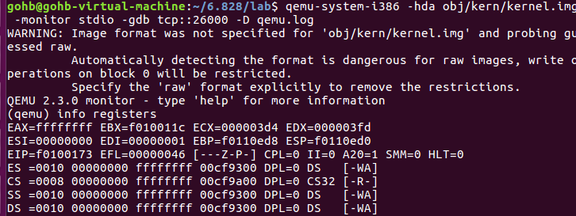

# Exercise 3

 虽然 GDB 只能通过虚拟地址访问 QEMU 的内存，但在设置虚拟内存时能够检查物理内存通常很有用。查看实验室工具指南中的 QEMU[监视器命令](https://pdos.csail.mit.edu/6.828/2018/labguide.html#qemu)，尤其是 `xp`命令，它可以让您检查物理内存。要访问 QEMU 监视器，请在终端中按下Ctrl-a c（相同的绑定返回到串行控制台）。

使用xpQEMU 监视器中的 x命令和 GDB 中的命令检查相应物理地址和虚拟地址处的内存，并确保您看到相同的数据。

我们的 QEMU 补丁版本提供了一个info pg 命令，它也可能被证明是有用的：它显示了当前页表的紧凑但详细的表示，包括所有映射的内存范围、权限和标志。Stock QEMU 还提供了一个info mem命令，显示映射了哪些虚拟地址范围以及具有哪些权限的概览。


答：

通过GDB，我们只能通过虚拟地址来查看内存所存放的内容，但是如果我们能够访问物理内存的话，肯定会更有帮助的。我们可以看一下QEMU中的一些常用指令，特别是xp指令，可以允许我们去访问物理内存地址。

　　“QEMU中有一个内置的监控器(moniter)，首先通过在运行着QEMU软件的terminal里面输入 ctrl-a c，可以让我们切换到这个监控器。” 这个是官方给出的做法，但是在我的机器上并不好使，所以通过查询，发现在lab目录下面输入如下指令，一样可以打开moniter：

```shell
　　qemu-system-i386 -hda obj/kern/kernel.img -monitor stdio -gdb tcp::26000 -D qemu.log  
```



打开monitor后，我们可以输入如下比较常见的指令：

　　xp/Nx paddr -- 查看paddr物理地址处开始的，N个字的16进制的表示结果。

　　info registers -- 展示所有内部寄存器的状态。

　　info mem -- 展示所有已经被页表映射的虚拟地址空间，以及它们的访问优先级。

　　info pg -- 展示当前页表的结构。