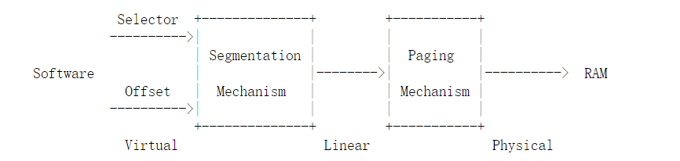
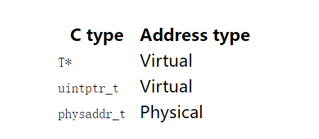

# Lab2 : Memory Management

lab2中多出来的几个文件：

　　inc/memlayout.h

　　kern/pmap.c

　　kern/pmap.h

　　kern/kclock.h

　　kern/kclock.c

memlayout.h描述了虚拟地址空间的结构，我们需要通过修改pmap.c文件来实现这个结构。memlayout.h和pmap.h文件定义了一个PageInfo结构，利用这个结构可以记录有哪些物理页是空闲的。kclock.c和kclock.h文件中操作的是用电池充电的时钟，以及CMOS RAM设备。在这个设备中记录着PC机拥有的物理内存的数量。在pmap.c中的代码必须读取这个设备中的信息才能弄清楚到底有多少内存。


# Part 1 : Physical Page Management

操作系统必须跟踪物理 RAM 的哪些部分是空闲的，哪些部分当前正在使用。JOS 以*页粒度*管理 PC 的物理内存， 以便它可以使用 MMU 来映射和保护每块分配的内存。

您现在将编写物理页分配器。它通过对象的链接列表跟踪哪些页面是空闲的`struct PageInfo`（与 xv6 不同，这些对象*不*嵌入空闲页面本身），每个对象对应一个物理页面。您需要先编写物理页面分配器，然后才能编写其余的虚拟内存实现，因为您的页表管理代码将需要分配物理内存来存储页表。


**Exercise 1** 


# Part 2 : Virtual Memory


**Exercise 2** 


#### Virtual, Linear, and Physical Addresses

在 x86 术语中，*虚拟地址* 由段选择器和段内的偏移量组成。*线性地址* 是在段翻译之后但在页面翻译之前得到的。*物理地址*是您在段和页面转换之后最终得到的 ，并且最终在硬件总线上输出到您的 RAM。



AC 指针是虚拟地址的“偏移”部分。在`boot/boot.S`中，我们安装了一个全局描述符表 (GDT)，它通过将所有段基地址设置为 0 并将限制设置为`0xffffffff`. 因此“选择器”没有任何作用，线性地址总是等于虚拟地址的偏移量。在实验 3 中，我们将不得不与分段进行更多交互以设置权限级别，但至于记忆翻译，我们可以在整个 JOS 实验室中忽略分段，只关注页面翻译。

回想一下，在实验 1 的第 3 部分中，我们安装了一个简单的页表，这样内核就可以在其链接地址 0xf0100000 处运行，即使它实际上是加载到 ROM BIOS 上方 0x00100000 处的物理内存中。这个页表只映射了 4MB 的内存。在您将在本实验中为 JOS 设置的虚拟地址空间布局中，我们将扩展它以映射从虚拟地址 0xf0000000 开始的前 256MB 物理内存，并映射虚拟地址空间的许多其他区域。


**Exercise 3**


从 CPU 上执行的代码来看，一旦我们处于保护模式（我们首先在`boot/boot.S`中输入），就无法直接使用线性或物理地址。 *所有*内存引用都被解释为虚拟地址并由 MMU 翻译，这意味着 C 中的所有指针都是虚拟地址。

JOS 内核经常需要将地址作为不透明的值或整数来操作，而不是取消引用它们，例如在物理内存分配器中。有时这些是虚拟地址，有时它们是物理地址。为了帮助记录代码，JOS 源代码区分了两种情况：类型`uintptr_t`表示不透明的虚拟地址，以及`physaddr_t`表示物理地址。这两种类型实际上只是 32 位整数 ( `uint32_t`) 的同义词，因此编译器不会阻止您将一种类型分配给另一种类型！由于它们是整数类型（不是指针），如果您尝试取消引用它们，编译器*会报错。*

JOS 内核可以`uintptr_t`通过首先将其转换为指针类型来取消引用 a。相反，内核不能明智地取消引用物理地址，因为 MMU 会转换所有内存引用。如果您将 a`physaddr_t`转换为指针并取消引用它，您可能能够加载并存储到结果地址（硬件会将其解释为虚拟地址），但您可能不会获得您想要的内存位置。


总结如下：



　问题：

　　　　假设下述JOS内核代码是正确的，那么变量x应该是uintptr_t类型呢，还是physaddr_t呢？　

```
mystery_t x;
char* value = return_a_pointer();
*value = 10;
x = (mystery_t) value;
```

　答：

　　　　由于这里使用了 * 操作符解析地址，所以变量x应该是uintptr_t类型。


JOS 内核有时需要读取或修改它只知道物理地址的内存。例如，向页表添加映射可能需要分配物理内存来存储页目录，然后初始化该内存。但是，内核无法绕过虚拟地址转换，因此无法直接加载和存储到物理地址。JOS 重新映射从物理地址 0 到虚拟地址 0xf0000000 的所有物理内存的原因之一是为了帮助内核读写它只知道物理地址的内存。为了将物理地址翻译成内核可以实际读写的虚拟地址，内核必须在物理地址上加上0xf0000000，以便在重新映射的区域中找到其对应的虚拟地址。你应该使用`KADDR(pa)`做那个加法。

JOS 内核有时还需要能够在给定存储内核数据结构的内存的虚拟地址的情况下找到物理地址。内核全局变量和分配的内存 `boot_alloc()`位于内核加载的区域中，从 0xf0000000 开始，即我们映射所有物理内存的区域。因此，要将这个区域中的虚拟地址转换为物理地址，内核可以简单地减去 0xf0000000。你应该用`PADDR(va)` 做那个减法。


#### Reference counting

　在之后的实验中，你将会经常遇到一种情况，多个不同的虚拟地址被同时映射到相同的物理页上面。这时我们需要记录一下每一个物理页上存在着多少不同的虚拟地址来引用它，这个值存放在这个物理页的PageInfo结构体的pp_ref成员变量中。当这个值变为0时，这个物理页才可以被释放。通常来说，任意一个物理页p的pp_ref值等于它在所有的页表项中，被位于虚拟地址UTOP之下的虚拟页所映射的次数（UTOP之上的地址范围在启动的时候已经被映射完成了，之后不会被改动）。

　  当我们使用page_alloc函数的时候需要注意。它所返回的页的引用计数值总是0，所以pp_ref应该被马上加一。


#### Page Table Management

　现在你应该可以着手开始编写管理页表的程序了：包括插入和删除线性地址到物理地址的映射关系，以及创建页表等操作。


**Exercise 4**


# Part 3 : Kernel Address Space

JOS把32位线性地址虚拟空间划分成两个部分。其中用户环境（进程运行环境）通常占据低地址的那部分，叫用户地址空间。而操作系统内核总是占据高地址的部分，叫内核地址空间。这两个部分的分界线是定义在memlayout.h文件中的一个宏 ULIM。JOS为内核保留了接近256MB的虚拟地址空间。这就可以理解了，为什么在实验1中要给操作系统设计一个高地址的地址空间。如果不这样做，用户环境的地址空间就不够了。


#### Permissions and Fault Isolation

由于内核和用户内存都存在于每个环境的地址空间中，我们将不得不在 x86 页表中使用权限位，以允许用户代码仅访问地址空间的用户部分。否则用户代码中的错误可能会覆盖内核数据，导致崩溃或更微妙的故障；用户代码也可能能够窃取其他环境的私有数据。请注意，可写权限位（`PTE_W`）会影响用户和内核代码！

用户环境将无权访问上述任何内存`ULIM`，而内核将能够读取和写入该内存。对于地址范围 `[UTOP,ULIM)`，内核和用户环境都拥有相同的权限：他们可以读但不能写这个地址范围。这个地址范围用于向用户环境公开某些只读的内核数据结构。最后，下面的地址空间 `UTOP`是供用户环境使用的；用户环境将设置访问此内存的权限。


#### Initializing the Kernel Address Space

现在您将在上面设置地址空间`UTOP`：地址空间的内核部分。 `inc/memlayout.h`显示您应该使用的布局。您将使用刚刚编写的函数来设置适当的线性到物理映射。

