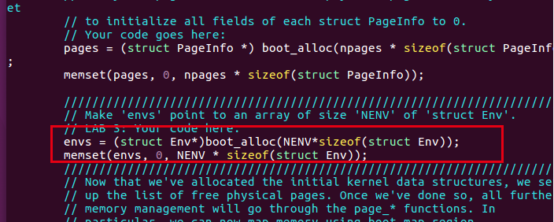
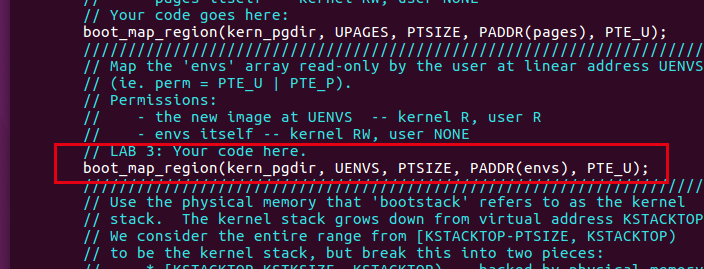

# Exercise 1

`mem_init()`在`kern/pmap.c`中 修改 以分配和映射`envs`数组。该数组由分配的结构的确切`NENV`实例组成，`Env` 就像您分配 `pages`数组的方式一样。与`pages`数组一样，内存支持 `envs`也应该以用户只读方式映射 `UENVS`（在`inc/memlayout.h`中定义），以便用户进程可以从该数组中读取。


答：

​	就像题目中说的那样，我们只需要像在Lab2里面分配pages数组那样，分配一个Env数组给指针envs就可以了。

　主要要在两个地方要添加代码，首先要在page_init()之前为envs分配内存空间。



```c
envs = (struct Env*)boot_alloc(NENV*sizeof(struct Env));
memset(envs, 0, NENV * sizeof(struct Env));
```

然后要在页表中设置它的映射关系，位于check_page()函数之后




```c
boot_map_region(kern_pgdir, UENVS, PTSIZE, PADDR(envs), PTE_U);
```

