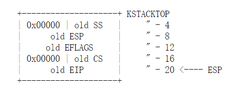
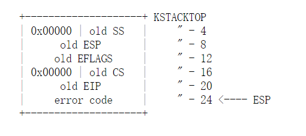
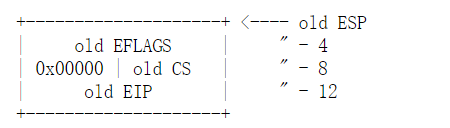
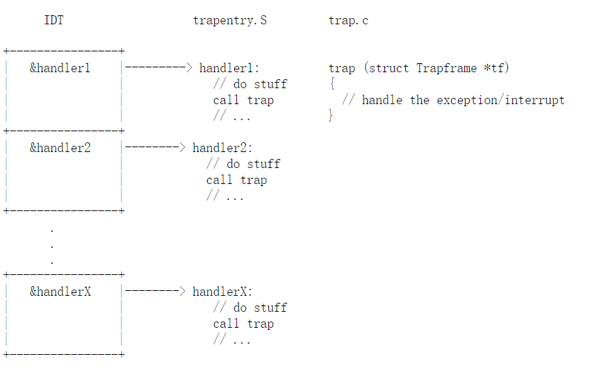

# Lab 3: User Environments

实验 3 包含许多新的源文件，您应该浏览它们：


　　在这个实验中，我们将实现操作系统的一些基本功能，来实现用户环境下的进程的正常运行。你将会加强JOS内核的功能，为它增添一些重要的数据结构，用来记录用户进程环境的一些信息；创建一个单一的用户环境，并且加载一个程序运行它。你也可以让JOS内核能够完成用户环境所作出的任何系统调用，以及处理用户环境产生的各种异常。


## Part A: User Environments and Exception Handling

　新包含的文件inc/env.h里面包含了JOS内核的有关用户环境(User Environment)的一些基本定义。用户环境指的就是一个应用程序运行在系统中所需要的一个上下文环境，操作系统内核使用数据结构 Env 来记录每一个用户环境的信息。在这个实验中，我们只会创建一个用户环境，但是之后我们会把它设计成能够支持多用户环境，即多个用户程序并发执行。

　　在 kern/env.c 文件中我们看到，操作系统一共维护了三个重要的和用户环境相关的全局变量：

```c
　　　　struct Env *envs = NULL;    //所有的 Env 结构体

　　　　struct Env *curenv = NULL;   //目前正在运行的用户环境

　　　　static struct Env *env_free_list;  //还没有被使用的 Env 结构体链表
```

一旦JOS启动，envs指针便指向了一个 Env 结构体链表，表示系统中所有的用户环境的env。在我们的设计中，JOS内核将支持同一时刻最多 NENV 个活跃的用户环境，尽管这个数字要比真实情况下任意给定时刻的活跃用户环境数要多很多。系统会为每一个活跃的用户环境在envs链表中维护一个 Env 结构体。

　　JOS内核也把所有不活跃的Env结构体，用env_free_list链接起来。这种设计方式非常方便进行用户环境env的分配和回收。

　　内核也会把 curenv 指针指向在任意时刻正在执行的用户环境的 Env 结构体。在内核启动时，并且还没有任何用户环境运行时，curenv的值为NULL。


#### Environment State

我们要看一下，Env结构体每一个字段的具体含义是什么，Env结构体定义在 inc/env.h 文件中

```c
struct Env {
	struct Trapframe env_tf;	// Saved registers
	struct Env *env_link;		// Next free Env
	envid_t env_id;			// Unique environment identifier
	envid_t env_parent_id;		// env_id of this env's parent
	enum EnvType env_type;		// Indicates special system environments
	unsigned env_status;		// Status of the environment
	uint32_t env_runs;		// Number of times environment has run

	// Address space
	pde_t *env_pgdir;		// Kernel virtual address of page dir
};
```

env_tf:

　　　　这个类型的结构体在inc/trap.h文件中被定义，里面存放着当用户环境暂停运行时，所有重要寄存器的值。内核也会在系统从用户态切换到内核态时保存这些值，这样的话用户环境可以在之后被恢复，继续执行。

　　env_link:

　　　　这个指针指向在env_free_list中，该结构体的后一个free的Env结构体。当然前提是这个结构体还没有被分配给任意一个用户环境时，该域才有用。

　　env_id:

　　　　这个值可以唯一的确定使用这个结构体的用户环境是什么。当这个用户环境终止，内核会把这个结构体分配给另外一个不同的环境，这个新的环境会有不同的env_id值。

　　env_parent_id:

　　　　创建这个用户环境的父用户环境的env_id

　　env_type:

　　　　用于区别出来某个特定的用户环境。对于大多数环境来说，它的值都是 ENV_TYPE_USER.

　　env_status:

　　　　这个变量存放以下可能的值

　　　　ENV_FREE: 代表这个结构体是不活跃的，应该在链表env_free_list中。

　　　　ENV_RUNNABLE: 代表这个结构体对应的用户环境已经就绪，等待被分配处理机。

　　　　ENV_RUNNING: 代表这个结构体对应的用户环境正在运行。

　　　　ENV_NOT_RUNNABLE: 代表这个结构体所代表的是一个活跃的用户环境，但是它不能被调度运行，因为它在等待其他环境传递给它的消息。

　　　　ENV_DYING: 代表这个结构体对应的是一个僵尸环境。一个僵尸环境在下一次陷入内核时会被释放回收。

　　env_pgdir:

　　　　这个变量存放着这个环境的页目录的虚拟地址


就像Unix中的进程一样，一个JOS环境中结合了“线程”和“地址空间”的概念。线程通常是由被保存的寄存器的值来定义的，而地址空间则是由env_pgdir所指向的页目录表还有页表来定义的。为了运行一个用户环境，内核必须设置合适的寄存器的值以及合适的地址空间。


#### Allocating the Environments Array

在lab 2，你在mem_init() 函数中分配了pages数组的地址空间，用于记录内核中所有的页的信息。现在你需要进一步去修改mem_init()函数，来分配一个Env结构体数组，叫做envs。

**Exercise 1**


### Creating and Running Environments

现在你需要去编写 kern/env.c 文件来运行一个用户环境了。由于你现在没有文件系统，所以必须把内核设置成能够加载内核中的静态二进制程序映像文件。

Lab3 里面的 GNUmakefile 文件在obj/user/目录下面生成了一系列的二进制映像文件。如果你看一下 kern/Makefrag 文件，你会发现一些奇妙的地方，这些地方把二进制文件直接链接到内核可执行文件中，只要这些文件是.o文件。其中在链接器命令行中的-b binary 选项会使这些文件被当做二进制执行文件链接到内核之后。

 

在 i386_init() 函数中，你会看到运行上述二进制文件的代码，但是我们需要完成能够设置这些代码的运行用户环境的功能。


**Exercise 2**


### Handling Interrupts and Exceptions

　　到目前为止，当程序运行到第一个系统调用 int $0x30 时，就会进入错误的状态，因为现在系统无法从用户态切换到内核态。所以你需要实现一个基本的异常/系统调用处理机制，使得内核可以从用户态转换为内核态。你应该先熟悉一下X86的异常中断机制。


**Exercise 3**


### Basics of Protected Control Transfer

　　异常(Exception)和中断(Interrupts)都是“受到保护的控制转移方法”，都会使处理器从用户态转移为内核态。在Intel的术语中，一个中断指的是由外部异步事件引起的处理器控制权转移，比如外部IO设备发送来的中断信号。一个异常则是由于当前正在运行的指令所带来的同步的处理器控制权的转移，比如除零溢出异常。

　　为了能够确保这些控制的转移能够真正被保护起来，处理器的中断/异常机制通常被设计为：用户态的代码无权选择内核中的代码从哪里开始执行。处理器可以确保只有在某些条件下，才能进入内核态。在X86上，有两种机制配合工作来提供这种保护：

1. 中断向量表：

　　　　处理器保证中断和异常只能够引起内核进入到一些特定的，被事先定义好的程序入口点，而不是由触发中断的程序来决定中断程序入口点。

　　　　X86允许多达256个不同的中断和异常，每一个都配备一个独一无二的中断向量。一个向量指的就是0到255中的一个数。一个中断向量的值是根据中断源来决定的：不同设备，错误条件，以及对内核的请求都会产生出不同的中断和中断向量的组合。CPU将使用这个向量作为这个中断在中断向量表中的索引，这个表是由内核设置的，放在内核空间中，和GDT很像。通过这个表中的任意一个表项，处理器可以知道：

　　　　*需要加载到EIP寄存器中的值，这个值指向了处理这个中断的中断处理程序的位置。

　　　　*需要加载到CS寄存器中的值，里面还包含了这个中断处理程序的运行特权级。（即这个程序是在用户态还是内核态下运行。）

2. 任务状态段

　　　　处理器还需要一个地方来存放，当异常/中断发生时，处理器的状态，比如EIP和CS寄存器的值。这样的话，中断处理程序一会可以重新返回到原来的程序中。这段内存自然也要保护起来，不能被用户态的程序所篡改。

　　　　正因为如此，当一个x86处理器要处理一个中断，异常并且使运行特权级从用户态转为内核态时，它也会把它的堆栈切换到内核空间中。一个叫做 “任务状态段（TSS）”的数据结构将会详细记录这个堆栈所在的段的段描述符和地址。处理器会把SS，ESP，EFLAGS，CS，EIP以及一个可选错误码等等这些值压入到这个堆栈上。然后加载中断处理程序的CS，EIP值，并且设置ESP，SS寄存器指向新的堆栈。

　　　　尽管TSS非常大，并且还有很多其他的功能，但是JOS仅仅使用它来定义处理器从用户态转向内核态所采用的内核堆栈，由于JOS中的内核态指的就是特权级0，所以处理器用TSS中的ESP0，SS0字段来指明这个内核堆栈的位置，大小。


### Types of Exceptions and Interrupts　

　　所有的由X86处理器内部产生的异常的向量值是0到31之间的整数。比如，页表错所对应的向量值是14.而大于31号的中断向量对应的是软件中断，由int指令生成；或者是外部中断，由外部设备生成。

　  在这一章，我们将扩展JOS的功能，使它能够处理0~31号内部异常。在下一章会让JOS能够处理48号软件中断，主要被用来做系统调用。在Lab4中会继续扩展JOS使它能够处理外部硬件中断，比如时钟中断。


### An Example

　　让我们看一个实例，假设处理器正在用户状态下运行代码，但是遇到了一个除法指令，并且除数为0.

　  1. 处理器会首先切换自己的堆栈，切换到由TSS的SS0，ESP0字段所指定的内核堆栈区，这两个字段分别存放着GD_KD和KSTACKTOP的值。

　　2. 处理器把异常参数压入到内核堆栈中，起始于地址KSTACKTOP：



　 3. 因为我们要处理的是除零异常，它的中断向量是0，处理器会读取IDT表中的0号表项，并且把CS:EIP的值设置为0号中断处理函数的地址值。

　　4. 中断处理函数开始执行，并且处理中断。

　　对于某些特定的异常，除了上面图中要保存的五个值之外，还要再压入一个字，叫做错误码。比如页表错，就是其中一个实例。当压入错误码之后，内核堆栈的状态如下：



　　以上几步都是由硬件自动完成的。

### Nested Exceptions and Interrupts

　　处理器在用户态下和内核态下都可以处理异常或中断。只有当处理器从用户态切换到内核态时，才会自动地切换堆栈，并且把一些寄存器中的原来的值压入到堆栈上，并且触发相应的中断处理函数。但如果处理器已经由于正在处理中断而处在内核态下时，此时CPU只会向内核堆栈压入更多的值。通过这种方式，内核就可处理嵌套中断。

　　如果处理器已经在内核态下并且遇到嵌套中断，因为它不需要切换堆栈，所以它不需要存储SS，ESP寄存器的值。此时内核堆栈的就像下面这个样子：



　　这里有一个重要的警告。如果处理器在内核态下接受一个异常，而且由于一些原因，比如堆栈空间不足，不能把当前的状态信息（寄存器的值）压入到内核堆栈中时，那么处理器是无法恢复到原来的状态了，它会自动重启。


### Setting Up the IDT

　　你现在应该有了所有的基本信息去设置IDT表，并且在JOS处理异常。现在你只需要处理内部异常（中断向量号0~31）。

　　在头文件 inc/trap.h和kern/trap.h 中包含了和中断异常相关的非常重要的定义，你应该好好熟悉一下。kern/trap.h 文件中包含了仅内核可见的一些定义， inc/trap.h 中包含了用户态也可见的一些定义。

　　最后你要实现的代码的效果如下：




每一个中断或异常都有它自己的中断处理函数，分别定义在 trapentry.S中，trap_init()将初始化IDT表。每一个处理函数都应该构建一个结构体 Trapframe 在堆栈上，并且调用trap()函数指向这个结构体，trap()然后处理异常/中断，给他分配一个中断处理函数。

　　所以整个操作系统的中断控制流程为：

　　1. trap_init() 先将所有中断处理函数的起始地址放到中断向量表IDT中。

　　2. 当中断发生时，不管是外部中断还是内部中断，处理器捕捉到该中断，进入核心态，根据中断向量去查询中断向量表，找到对应的表项

　　3. 保存被中断的程序的上下文到内核堆栈中，调用这个表项中指明的中断处理函数。

　　4. 执行中断处理函数。

　　5. 执行完成后，恢复被中断的进程的上下文，返回用户态，继续运行这个进程。


**Exercise 4**


 Question:

　　1. What is the purpose of having an individual handler function for each exception/interrupt? (i.e., if all exceptions/interrupts were delivered to the same handler, what feature that exists in the current implementation could not be provided?)

  答：

　　　　不同的中断或者异常当然需要不同的中断处理函数，因为不同的异常/中断可能需要不同的处理方式，比如有些异常是代表指令有错误，则不会返回被中断的命令。而有些中断可能只是为了处理外部IO事件，此时执行完中断函数还要返回到被中断的程序中继续运行。

　　2. Did you have to do anything to make the user/softint program behave correctly? The grade script expects it to produce a general protection fault (trap 13), but softint's code says int $14. Why should this produce interrupt vector 13? What happens if the kernel actually allows softint's int $14 instruction to invoke the kernel's page fault handler (which is interrupt vector 14)?

  答：

　　　　因为当前的系统正在运行在用户态下，特权级为3，而INT指令为系统指令，特权级为0。特权级为3的程序不能直接调用特权级为0的程序，会引发一个General Protection Exception，即trap 13。

 


现在你的操作系统内核已经具备一定的异常处理能力了，在这部分实验中，我们将会进一步完善它，使它能够处理不同类型的中断/异常。

## Handling Page Fault

　　缺页中断是一个非常重要的中断，因为我们在后续的实验中，非常依赖于能够处理缺页中断的能力。当缺页中断发生时，系统会把引起中断的线性地址存放到控制寄存器 CR2 中。在trap.c 中，已经提供了一个能够处理这种缺页异常的函数page_fault_handler()。


**Exercise 5**

我们之后还会对这个中断处理函数进一步改进。

## Breaking Points Exception 

　　断点异常，异常号为3，这个异常可以让调试器能够给程序加上断点。加断点的基本原理就是把要加断点的语句用一个 INT3 指令替换，执行到INT3时，会触发软中断。在JOS中，我们将通过把这个异常转换成一个伪系统调用，这样的话任何用户环境都可以使用这个伪系统调用来触发JOS kernel monitor。


**Exercise 6**


　Question

　　　　3. 在上面的break point exception测试程序中，如果你在设置IDT时，对break point exception采用不同的方式进行设置，可能会产生触发不同的异常，有可能是break point exception，有可能是 general protection exception。这是为什么？你应该怎么做才能得到一个我们想要的breakpoint exception，而不是general protection exception？

　　　　答：

　　　　　　通过实验发现出现这个现象的问题就是在设置IDT表中的breakpoint exception的表项时，如果我们把表项中的DPL字段设置为3，则会触发break point exception，如果设置为0，则会触发general protection exception。DPL字段代表的含义是段描述符优先级（Descriptor Privileged Level），如果我们想要当前执行的程序能够跳转到这个描述符所指向的程序哪里继续执行的话，有个要求，就是要求当前运行程序的CPL，RPL的最大值需要小于等于DPL，否则就会出现优先级低的代码试图去访问优先级高的代码的情况，就会触发general protection exception。那么我们的测试程序首先运行于用户态，它的CPL为3，当异常发生时，它希望去执行 int 3指令，这是一个系统级别的指令，用户态命令的CPL一定大于 int 3 的DPL，所以就会触发general protection exception，但是如果把IDT这个表项的DPL设置为3时，就不会出现这样的现象了，这时如果再出现异常，肯定是因为我们还没有编写处理break point exception的程序所引起的，所以是break point exception。


## System Calls

　　用户程序会要求内核帮助它完成系统调用。当用户程序触发系统调用，系统进入内核态。处理器和操作系统将保存该用户程序当前的上下文状态，然后由内核将执行正确的代码完成系统调用，然后回到用户程序继续执行。而用户程序到底是如何得到操作系统的注意，以及它如何说明它希望操作系统做什么事情的方法是有很多不同的实现方式的。

　　在JOS中，我们会采用int指令，这个指令会触发一个处理器的中断。特别的，我们用int $0x30来代表系统调用中断。注意，中断0x30不是通过硬件产生的。

　　应用程序会把系统调用号以及系统调用的参数放到寄存器中。通过这种方法，内核就不需要去查询用户程序的堆栈了。系统调用号存放到 %eax 中，参数则存放在 %edx, %ecx, %ebx, %edi, 和 %esi 中。内核会把返回值送到 %eax中。在lib/syscall.c中已经写好了触发一个系统调用的代码。　　
