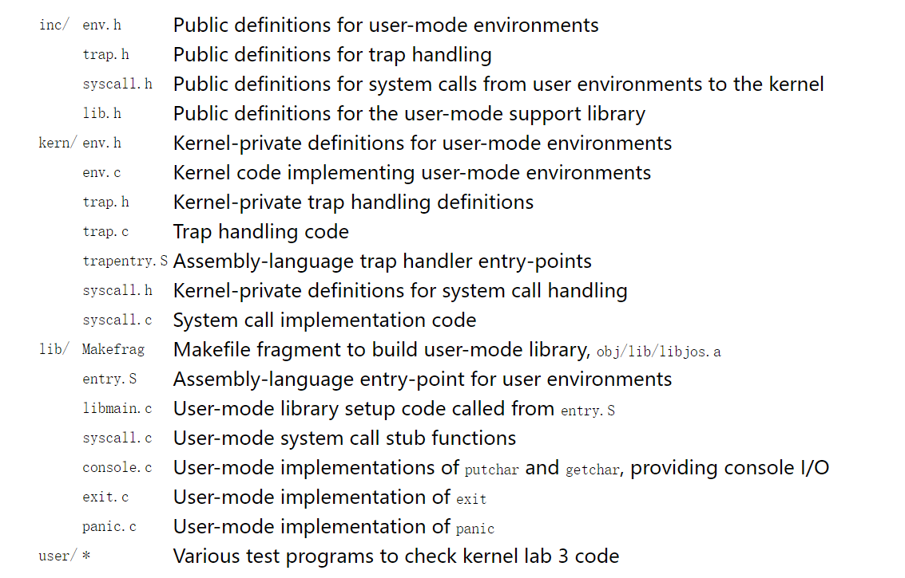

# Lab 3: User Environments

实验 3 包含许多新的源文件，您应该浏览它们：



　　在这个实验中，我们将实现操作系统的一些基本功能，来实现用户环境下的进程的正常运行。你将会加强JOS内核的功能，为它增添一些重要的数据结构，用来记录用户进程环境的一些信息；创建一个单一的用户环境，并且加载一个程序运行它。你也可以让JOS内核能够完成用户环境所作出的任何系统调用，以及处理用户环境产生的各种异常。


## Part A: User Environments and Exception Handling

　新包含的文件inc/env.h里面包含了JOS内核的有关用户环境(User Environment)的一些基本定义。用户环境指的就是一个应用程序运行在系统中所需要的一个上下文环境，操作系统内核使用数据结构 Env 来记录每一个用户环境的信息。在这个实验中，我们只会创建一个用户环境，但是之后我们会把它设计成能够支持多用户环境，即多个用户程序并发执行。

　　在 kern/env.c 文件中我们看到，操作系统一共维护了三个重要的和用户环境相关的全局变量：

```c
　　　　struct Env *envs = NULL;    //所有的 Env 结构体

　　　　struct Env *curenv = NULL;   //目前正在运行的用户环境

　　　　static struct Env *env_free_list;  //还没有被使用的 Env 结构体链表
```

一旦JOS启动，envs指针便指向了一个 Env 结构体链表，表示系统中所有的用户环境的env。在我们的设计中，JOS内核将支持同一时刻最多 NENV 个活跃的用户环境，尽管这个数字要比真实情况下任意给定时刻的活跃用户环境数要多很多。系统会为每一个活跃的用户环境在envs链表中维护一个 Env 结构体。

　　JOS内核也把所有不活跃的Env结构体，用env_free_list链接起来。这种设计方式非常方便进行用户环境env的分配和回收。

　　内核也会把 curenv 指针指向在任意时刻正在执行的用户环境的 Env 结构体。在内核启动时，并且还没有任何用户环境运行时，curenv的值为NULL。


#### Environment State

我们要看一下，Env结构体每一个字段的具体含义是什么，Env结构体定义在 inc/env.h 文件中

```c
struct Env {
	struct Trapframe env_tf;	// Saved registers
	struct Env *env_link;		// Next free Env
	envid_t env_id;			// Unique environment identifier
	envid_t env_parent_id;		// env_id of this env's parent
	enum EnvType env_type;		// Indicates special system environments
	unsigned env_status;		// Status of the environment
	uint32_t env_runs;		// Number of times environment has run

	// Address space
	pde_t *env_pgdir;		// Kernel virtual address of page dir
};
```

env_tf:

　　　　这个类型的结构体在inc/trap.h文件中被定义，里面存放着当用户环境暂停运行时，所有重要寄存器的值。内核也会在系统从用户态切换到内核态时保存这些值，这样的话用户环境可以在之后被恢复，继续执行。

　　env_link:

　　　　这个指针指向在env_free_list中，该结构体的后一个free的Env结构体。当然前提是这个结构体还没有被分配给任意一个用户环境时，该域才有用。

　　env_id:

　　　　这个值可以唯一的确定使用这个结构体的用户环境是什么。当这个用户环境终止，内核会把这个结构体分配给另外一个不同的环境，这个新的环境会有不同的env_id值。

　　env_parent_id:

　　　　创建这个用户环境的父用户环境的env_id

　　env_type:

　　　　用于区别出来某个特定的用户环境。对于大多数环境来说，它的值都是 ENV_TYPE_USER.

　　env_status:

　　　　这个变量存放以下可能的值

　　　　ENV_FREE: 代表这个结构体是不活跃的，应该在链表env_free_list中。

　　　　ENV_RUNNABLE: 代表这个结构体对应的用户环境已经就绪，等待被分配处理机。

　　　　ENV_RUNNING: 代表这个结构体对应的用户环境正在运行。

　　　　ENV_NOT_RUNNABLE: 代表这个结构体所代表的是一个活跃的用户环境，但是它不能被调度运行，因为它在等待其他环境传递给它的消息。

　　　　ENV_DYING: 代表这个结构体对应的是一个僵尸环境。一个僵尸环境在下一次陷入内核时会被释放回收。

　　env_pgdir:

　　　　这个变量存放着这个环境的页目录的虚拟地址


就像Unix中的进程一样，一个JOS环境中结合了“线程”和“地址空间”的概念。线程通常是由被保存的寄存器的值来定义的，而地址空间则是由env_pgdir所指向的页目录表还有页表来定义的。为了运行一个用户环境，内核必须设置合适的寄存器的值以及合适的地址空间。


#### Allocating the Environments Array

在lab 2，你在mem_init() 函数中分配了pages数组的地址空间，用于记录内核中所有的页的信息。现在你需要进一步去修改mem_init()函数，来分配一个Env结构体数组，叫做envs。


### Creating and Running Environments

现在你需要去编写 kern/env.c 文件来运行一个用户环境了。由于你现在没有文件系统，所以必须把内核设置成能够加载内核中的静态二进制程序映像文件。

Lab3 里面的 GNUmakefile 文件在obj/user/目录下面生成了一系列的二进制映像文件。如果你看一下 kern/Makefrag 文件，你会发现一些奇妙的地方，这些地方把二进制文件直接链接到内核可执行文件中，只要这些文件是.o文件。其中在链接器命令行中的-b binary 选项会使这些文件被当做二进制执行文件链接到内核之后。

 

在 i386_init() 函数中，你会看到运行上述二进制文件的代码，但是我们需要完成能够设置这些代码的运行用户环境的功能。