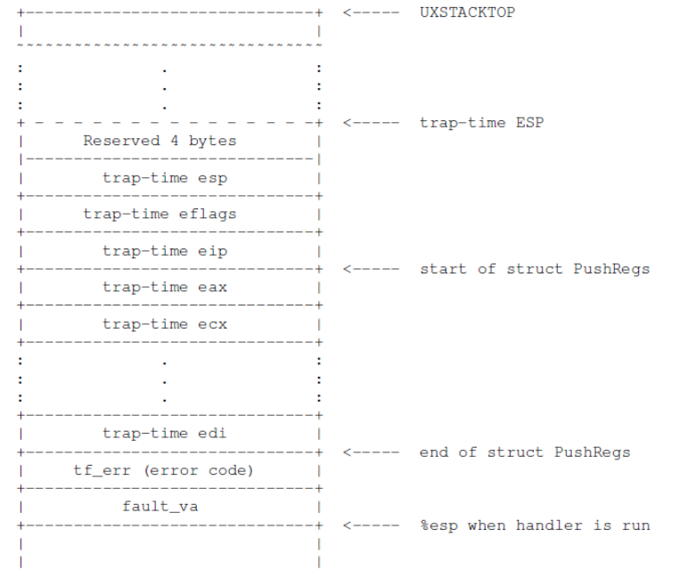
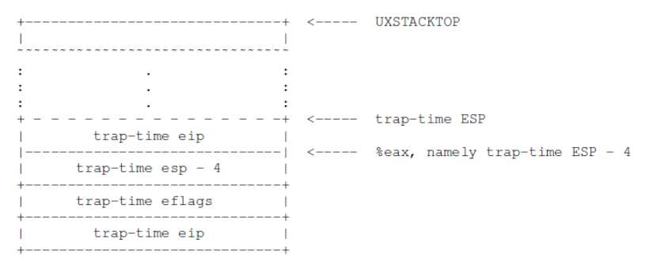
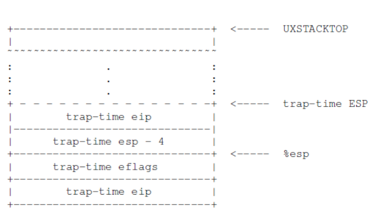

# Exercise 10

在 lib/pfentry.S 中实现 _pgfault_upcall 例程。 有趣的部分是返回到用户代码中导致页面错误的原始点。 您将直接返回那里，而无需通过内核返回。 困难的部分是同时切换堆栈和重新加载 EIP。


答：

```c
.text
.globl _pgfault_upcall
_pgfault_upcall:
        // Call the C page fault handler.
        pushl %esp                      // function argument: pointer to UTF
        movl _pgfault_handler, %eax
        call *%eax
        addl $4, %esp  
        //
        // Throughout the remaining code, think carefully about what
        // registers are available for intermediate calculations.  You
        // may find that you have to rearrange your code in non-obvious
        // ways as registers become unavailable as scratch space.
        //
        // LAB 4: Your code here.
        movl 0x28(%esp), %ebx  # trap-time eip
        subl $0x4, 0x30(%esp)  # trap-time esp minus 4
        movl 0x30(%esp), %eax
        movl %ebx, (%eax)      # trap-time esp store trap-time eip
        addl $0x8, %esp

        // Restore the trap-time registers.  After you do this, you
        // can no longer modify any general-purpose registers.
        // LAB 4: Your code here.
        popal

        // Restore eflags from the stack.  After you do this, you can
        // no longer use arithmetic operations or anything else that
        // modifies eflags.
        // LAB 4: Your code here.
        addl $0x4, %esp
        popfl

        // Switch back to the adjusted trap-time stack.
        // LAB 4: Your code here.
        popl %esp

        // Return to re-execute the instruction that faulted.
        // LAB 4: Your code here.
        ret
```


　　分析：
　　重点是调用_pgfault_handler返回时的操作，此时的异常栈结构如下：



　这里trap-time esp上的空间有1个4字节的保留空间，是做为中断递归的情形。
　　然后将栈中的trap-time esp取出减去4，再存回栈中。此时如果是中断递归中，esp-4即是保留的4字节地址；如果不是则是用户运行栈的栈顶。
　　再将原来出错程序的EIP(即trap-time eip)取出放入保留的4字节，以便后来恢复运行。此时的异常栈布局如下：



紧接着恢复通用寄存器和EFLAG标志寄存器，此时的异常栈结构如下：



然后pop esp切换为原来出错程序的运行栈，最后使用ret返回出错程序。