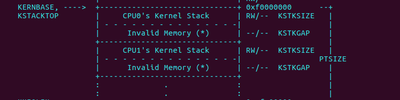

# Exercise 3

 修改 mem_init_mp()（在 kern/pmap.c 中）以映射从 KSTACKTOP 开始的每个 CPU 堆栈，如 inc/memlayout.h 中所示。 每个堆栈的大小是 KSTKSIZE 字节加上未映射保护页的 KSTKGAP 字节。 您的代码应该通过 check_kern_pgdir() 中的新检查。


答：

 多CPU的内存分布如下：



需要为每个核都分配一个内核栈，每个内核栈的大小是KSTKSIZE，而内核栈之间的间距是KSTKGAP，起到保护作用。


```c
// Modify mappings in kern_pgdir to support SMP
//   - Map the per-CPU stacks in the region [KSTACKTOP-PTSIZE, KSTACKTOP)
//
static void
mem_init_mp(void)
{
        // Map per-CPU stacks starting at KSTACKTOP, for up to 'NCPU' CPUs.
        //
        // For CPU i, use the physical memory that 'percpu_kstacks[i]' refers
        // to as its kernel stack. CPU i's kernel stack grows down from virtual
        // address kstacktop_i = KSTACKTOP - i * (KSTKSIZE + KSTKGAP), and is
        // divided into two pieces, just like the single stack you set up in
        // mem_init:
        //     * [kstacktop_i - KSTKSIZE, kstacktop_i)
        //          -- backed by physical memory
        //     * [kstacktop_i - (KSTKSIZE + KSTKGAP), kstacktop_i - KSTKSIZE)
        //          -- not backed; so if the kernel overflows its stack,
        //             it will fault rather than overwrite another CPU's stack.
        //             Known as a "guard page".
        //     Permissions: kernel RW, user NONE
        //
        // LAB 4: Your code here:
        for (int i = 0; i < NCPU; ++i) {
                uintptr_t kstacktop = KSTACKTOP - i * (KSTKSIZE + KSTKGAP);
                boot_map_region(kern_pgdir, kstacktop - KSTKSIZE, KSTKSIZE, PADDR(percpu_kstacks[i]), PTE_W);
        }

}
```

