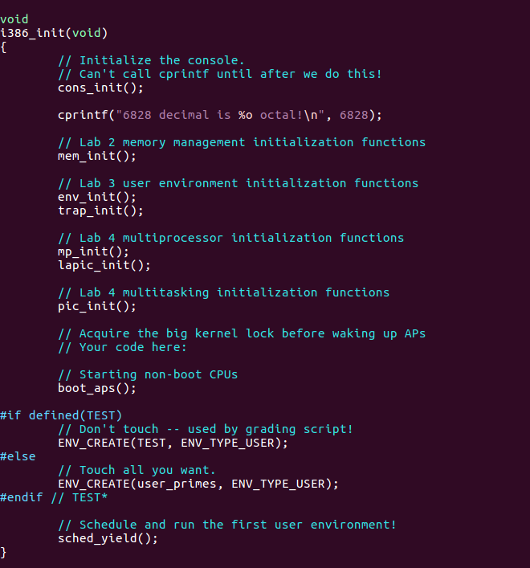
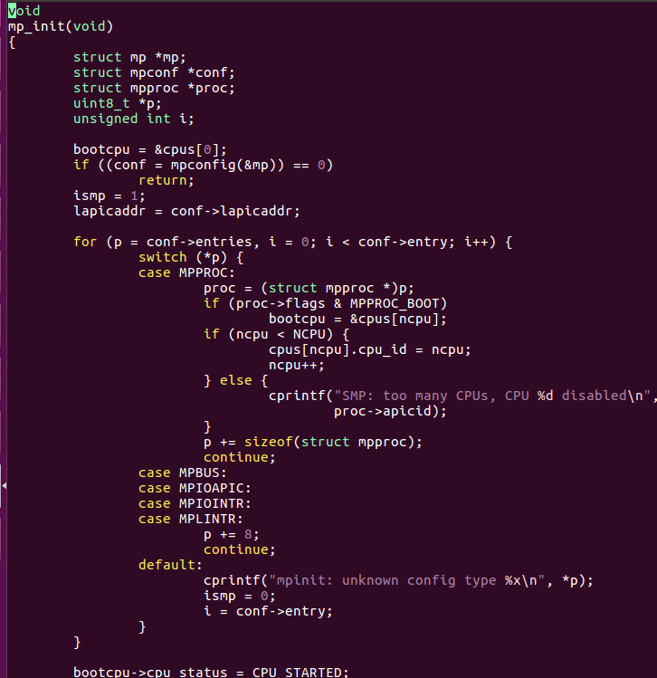
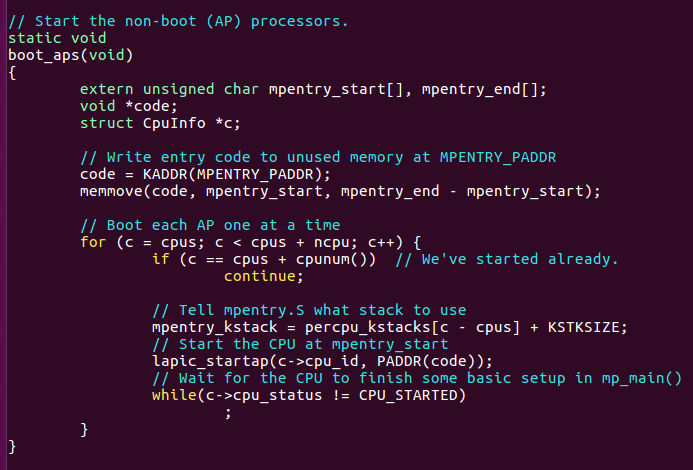

# Lab 4: Preemptive Multitasking


## **Introduction**

在本实验中，您将在多个同时处于活动状态的用户模式环境中实现抢占式多任务处理。

在 A 部分中，您将为 JOS 添加多处理器支持，实现循环调度，并添加基本的环境管理系统调用（创建和销毁环境以及分配/映射内存的调用）。

在 B 部分中，您将实现一个类 Unix `fork()`，它允许用户模式环境创建自身的副本。

最后，在 C 部分中，您将添加对进程间通信 (IPC) 的支持，允许不同的用户模式环境显式地相互通信和同步。您还将添加对硬件时钟中断和抢占的支持。

Lab 4添加的源文件：

1. kern/cpu.h 对多处理器支持的内核私有定义
2. kern/mpconfig.c 读取多处理器配置的代码
3. kern/lapic.c 引导每个CPU上的Local APIC的内核代码
4. kern/mpentry.S 非启动CPU的入口汇编代码
5. kern/spinlock.h 内核自旋锁定义
6. kern/spinlock.c 自旋锁实现的内核代码
7. kern/sched.c 调度器代码框架


## Part A: Multiprocessor Support and Cooperative Multitasking

在本实验的第一部分，您将首先扩展 JOS 以在多处理器系统上运行，然后实现一些新的 JOS 内核系统调用以允许用户级环境创建额外的新环境。您还将实现*协作*式循环调度，允许内核在当前环境自愿放弃 CPU（或退出）时从一个环境切换到另一个环境。稍后在 C 部分中，您将实现*抢占式*调度，它允许内核在经过一定时间后从环境中重新控制 CPU，即使环境不合作也是如此。


#### Multiprocessor Support

我们将让 JOS 支持“对称多处理”（SMP），这是一种多处理器模型，其中所有 CPU 对系统资源（例如内存和 I/O 总线）具有同等访问权限。虽然在 SMP 中所有 CPU 在功能上都是相同的，但在引导过程中它们可以分为两种类型：引导处理器 (BSP) 负责初始化系统和引导操作系统；只有在操作系统启动并运行后，BSP 才会激活应用处理器 (AP)。哪个处理器是 BSP 是由硬件和 BIOS 决定的。至此，您现有的所有 JOS 代码都在 BSP 上运行。

在 SMP 系统中，每个 CPU 都有一个随附的本地 APIC (LAPIC) 单元。LAPIC 单元负责在整个系统中传递中断。LAPIC 还为其连接的 CPU 提供唯一标识符。在本实验中，我们使用了 LAPIC 单元（在`kern/lapic.c`中）的以下基本功能：

- 读取 LAPIC 标识符 (APIC ID) 以了解我们的代码当前在哪个 CPU 上运行（请参阅 参考资料`cpunum()`）。
- 从 BSP 向 AP发送`STARTUP`处理器间中断 (IPI) 以启动其他 CPU（请参阅 参考资料 `lapic_startap()`）。
- 在 C 部分中，我们对 LAPIC 的内置定时器进行编程以触发时钟中断以支持抢先式多任务处理（请参阅 参考资料 `apic_init()`）。

处理器使用内存映射 I/O (MMIO) 访问其 LAPIC。在 MMIO 中，一部分*物理*内存被硬连线到一些 I/O 设备的寄存器，因此通常用于访问内存的相同加载/存储指令可用于访问设备寄存器。您已经在物理地址 `0xA0000`处看到了一个 IO 孔（我们使用它来写入 VGA 显示缓冲区）。LAPIC 存在于一个从物理地址 `0xFE000000`开始的洞中（4GB 短 32MB），因此对于我们使用 KERNBASE 中常用的直接映射来访问它来说太高了。JOS 虚拟内存映射在`MMIOBASE处留下 4MB 的空白`所以我们有一个地方可以映射这样的设备。由于后面的实验会引入更多的 MMIO 区域，因此您将编写一个简单的函数来从该区域分配空间并将设备内存映射到该区域。


**Exercise 1**


#### **Application Processor Bootstrap**

在启动 AP 之前，BSP 应该首先收集有关多处理器系统的信息，例如 CPU 的总数、它们的 APIC ID 和 LAPIC 单元的 MMIO 地址。`kern/mpconfig.c`中的`mp_init()`函数 通过读取位于 BIOS 内存区域中的 MP 配置表来检索此信息。``

该`boot_aps()`函数（在`kern/init.c`中）驱动 AP 引导过程。AP 以实模式启动，就像引导加载程序在`boot/boot.S`中启动的方式一样，因此`boot_aps()` 将 AP 入口代码 ( `kern/mpentry.S` ) 复制到在实模式下可寻址的内存位置。与引导加载程序不同，我们可以控制 AP 开始执行代码的位置；我们将入口代码复制到`0x7000` ( `MPENTRY_PADDR`)，但是任何低于 640KB 的未使用的、页面对齐的物理地址都可以使用。

之后`boot_aps()`，通过向`STARTUP`相应 AP 的 LAPIC 单元发送 IPI 以及`CS:IP`AP 应该开始运行其入口代码的初始地址（`MPENTRY_PADDR`在我们的例子中），一个接一个地激活 AP。`kern/mpentry.S`中的入口代码与`boot/boot.S`中的入口代码非常相似。经过一些简短的设置后，它将 AP 置于启用分页的保护模式，然后调用 C 设置例程`mp_main()`（也在`kern/init.c 中`）。 在继续唤醒下一个之前， `boot_aps()`等待 AP 在其字段中发出`CPU_STARTED`标志信号。

总结：



在i386init函数中进行BSP启动的一些配置，经由lab2的 mem_init，lab3的env_init和trap_init，lab4的mp_init和lapic_init，然后boot_aps函数启动所有的CPU。
　　 多核处理器的初始化都在mp_init函数中完成，首先是调用mpconfig函数，主要功能是寻找一个MP 配置条目，然后对所有的CPU进行配置，找到启动的处理器。



 在启动过程中，mp_init和lapic_init是和硬件以及体系架构紧密相关的，通过读取某个特殊内存地址（当然前提是能读取的到，所以在mem_init中需要修改进行相应映射），来获取CPU的信息，根据这些信息初始化CPU结构。
　　 在boot_aps函数中首先找到一段用于启动的汇编代码，该代码和上一章实验一样是嵌入在内核代码段之上的一部分，其中mpentry_start和mpentry_end是编译器导出符号，代表这段代码在内存（虚拟地址）中的起止位置，接着把代码复制到MPENTRY_PADDR处。随后调用lapic_startap来命令特定的AP去执行这段代码。




**Exercise 2**


Qusetion 1：
　　 仔细比较kern/mpentry.S与boot/boot.S，想想kern/mpentry.S是被编译链接来运行在KERNBASE之上的，那么定义MPBOOTPHYS宏的目的是什么？为什么在kern/mpentry.S中是必要的，在boot/boot.S中不是呢？换句话说，如果我们在kern/mpentry.S中忽略它，会出现什么错误？
　　 回答：
　　 #define MPBOOTPHYS(s) ((s) - mpentry_start + MPENTRY_PADDR))))
　　 MPBOOTPHYS is to calculate symobl address relative to MPENTRY_PADDR. The ASM is executed in the load address above KERNBASE, but JOS need to run mp_main at 0x7000 address! Of course 0x7000’s page is reserved at pmap.c.
　　 在AP的保护模式打开之前，是没有办法寻址到3G以上的空间的，因此用MPBOOTPHYS是用来计算相应的物理地址的。
但是在boot.S中，由于尚没有启用分页机制，所以我们能够指定程序开始执行的地方以及程序加载的地址；但是，在mpentry.S的时候，由于主CPU已经处于保护模式下了，因此是不能直接指定物理地址的，给定线性地址，映射到相应的物理地址是允许的。


#### Per-CPU State and Initialization

​	在编写多处理器操作系统时，区分每个处理器专用的每个 CPU 状态和整个系统共享的全局状态非常重要。 `kern/cpu.h`定义了大多数 per-CPU 状态，包括`struct CpuInfo`，它存储 per-CPU 变量。 `cpunum()`总是返回调用它的 CPU 的 ID，它可以用作数组的索引，如 `cpus`. 或者，宏`thiscpu`是当前 CPU 的简写`struct CpuInfo`。

以下是您应该注意的每个 CPU 的状态：

- **每个 CPU 内核堆栈**。
  由于多个 CPU 可以同时陷入内核，因此我们需要为每个处理器设置一个单独的内核堆栈，以防止它们干扰彼此的执行。该数组 `percpu_kstacks[NCPU][KSTKSIZE]`为 NCPU 的内核堆栈保留空间。

  `bootstack` 在实验 2 中，您映射了称为 BSP 的内核堆栈 的物理内存，就在`KSTACKTOP`. 同样，在本实验中，您将把每个 CPU 的内核堆栈映射到这个区域，保护页面充当它们之间的缓冲区。CPU 0 的堆栈仍然会从`KSTACKTOP`;向下增长。CPU 1 的堆栈将从`KSTKGAP`CPU 0 的堆栈底部以下的字节开始，依此类推。`inc/memlayout.h`显示映射布局。

- **每 CPU TSS 和 TSS 描述符**。
  为了指定每个 CPU 的内核堆栈所在的位置，还需要每个 CPU 的任务状态段 (TSS)。CPU *i*的 TSS存储在 中`cpus[i].cpu_ts`，相应的 TSS 描述符在 GDT 条目中定义`gdt[(GD_TSS0 >> 3) + i]`。`kern/trap.c`中定义的全局`ts`变量将不再有用。``

- **每 CPU 当前环境指针**。
  由于每个 CPU 可以同时运行不同的用户进程，我们重新定义了符号`curenv`来引用 `cpus[cpunum()].cpu_env`（或`thiscpu->cpu_env`），它指向*当前*CPU 上*当前*执行 的环境（代码正在运行的 CPU）。

- **每个 CPU 系统寄存器**。
  所有寄存器，包括系统寄存器，都是 CPU 专用的。因此，初始化这些寄存器的指令，如`lcr3()`、 `ltr()`、`lgdt()`、`lidt()`等，必须在每个 CPU 上执行一次。函数`env_init_percpu()` 和`trap_init_percpu()`是为此目的而定义的。

- 除此之外，如果您在解决方案中添加了任何额外的每个 CPU 状态或执行了任何额外的特定于 CPU 的初始化（例如，在 CPU 寄存器中设置新位）以挑战早期实验中的问题，请务必复制它们在这里的每个 CPU 上！


**Exercise 3**

**Exercise 4**


#### Locking
　　 在mp_main函数中初始化AP后，代码就会进入自旋。在让AP进行更多操作之前，我们首先要解决多CPU同时运行在内核时产生的竞争问题。最简单的办法是实现1个大内核锁，1次只让一个进程进入内核模式，当离开内核时释放锁。
　　 在kern/spinlock.h中声明了大内核锁，提供了lock_kernel和unlock_kernel函数来快捷地获得和释放锁。总共有四处用到大内核锁：

`kern/spinlock.h`声明了大内核锁，即 `kernel_lock`. 它还提供了`lock_kernel()` 和`unlock_kernel()`，获取和释放锁的快捷方式。您应该在四个位置应用大内核锁：

- 在`i386_init()`中，在 BSP 唤醒其他 CPU 之前获取锁。
- 中`mp_main()`，初始化AP后获取锁，然后调用`sched_yield()`该AP上开始运行环境。
- 在`trap()`中，从用户模式捕获时获取锁。要确定陷阱是在用户模式还是内核模式中发生，请检查`tf_cs`.
- 在中，在 切换到用户模式*之前*`env_run()`立即释放锁定。不要太早或太晚这样做，否则你会遇到竞争或僵局。


**Exercise 5**


 Question2:
　　 既然大内核锁保证了只有1个CPU能运行在内核，为什么我们还要为每个CPU准备1个内核栈。
　　 回答：
　　 因为不同的内核栈上可能保存有不同的信息，当1个CPU从内核退出来之后，有可能在内核栈中留下了一些将来还有用的数据，所以一定要有单独的栈。

Challenge 1:
　　 大内核锁简单便于应用，但是它取消了内核模式的并行。大多数现代操作系统使用不同的锁来保护共享状态的不同部分，这称之为细粒度锁。细粒度锁能有效地提高性能，但是也更困难地去实现和检测错误。所以你可以去掉大内核锁，在JOS中实现内核并发。
　　 回答：
　　 实验指导中提供了一些JOS内核中的共享结构，具体实现就是在保证在使用这些结构体时保证互斥。


#### 循环调度

您在本实验中的下一个任务是更改 JOS 内核，以便它可以以“循环”方式在多个环境之间交替。JOS 中的循环调度工作如下：

- `sched_yield()`新的`kern/sched.c`中 的函数 负责选择一个新的环境来运行。它以循环方式顺序搜索`envs[]`数组，从先前运行的环境之后开始（或者如果没有先前运行的环境，则从数组的开头开始），选择它找到的第一个环境，状态为`ENV_RUNNABLE` （参见`inc/env. h` )，并调用`env_run()`跳转到该环境。
- `sched_yield()`决不能同时在两个 CPU 上运行相同的环境。它可以判断一个环境当前正在某个 CPU（可能是当前 CPU）上运行，因为该环境的状态将为`ENV_RUNNING`.
- 我们为您实现了一个新的系统调用， `sys_yield()`用户环境可以调用该系统调用来调用内核的`sched_yield()`功能，从而自愿将 CPU 交给不同的环境。


**Exercise 6**


 然后修改kern/syscall.c添加相关的系统调用分发机制。
　　 Question 3：
　　 在lcr3运行之后，这个CPU对应的页表就立刻被换掉了，但是这个时候的参数e，也就是现在的curenv，为什么还是能正确的解引用？
　　 回答：
　　 因为当前是运行在系统内核中的，而每个进程的页表中都是存在内核映射的。每个进程页表中虚拟地址高于UTOP之上的地方，只有UVPT不一样，其余的都是一样的，只不过在用户态下是看不到的。所以虽然这个时候的页表换成了下一个要运行的进程的页表，但是curenv的地址没变，映射也没变，还是依然有效的。
　　 Question 4：
　　 在用户环境进行切换时，为什么旧进程的寄存器一定要被保存以便之后重新装载？在哪里发生这样的操作？
　　 回答：
　　 因为不进行保存，旧进程运行时的状态就丢失了，运行就不正确了。每次进入到内核态的时候，当前的运行状态都是在一进入的时候就保存了的。如果没有发生调度，那么之前trapframe中的信息还是会恢复回去，如果发生了调度，恢复的就是被调度运行的进程的上下文了。


**System Calls for Environment Creation**

尽管您的内核现在能够在多个用户级环境之间运行和切换，但它仍然仅限于*内核*最初设置的运行环境。您现在将实现必要的 JOS 系统调用，以允许*用户*环境创建和启动其他新用户环境。

Unix 提供`fork()`系统调用作为其进程创建原语。Unix`fork()`复制调用进程（父进程）的整个地址空间来创建一个新进程（子进程）。从用户空间观察到的两个可观察对象之间的唯一区别是它们的进程 ID 和父进程 ID（由`getpid`and返回`getppid`）。在父进程中， `fork()`返回子进程 ID，而在子进程中，`fork()`返回 0。默认情况下，每个进程都有自己的私有地址空间，并且两个进程对内存的修改都不可见。

您将提供一组不同的、更原始的 JOS 系统调用来创建新的用户模式环境。`fork()`通过这些系统调用，除了其他风格的环境创建之外，您将能够完全在用户空间中实现类 Unix 。您将为 JOS 编写的新系统调用如下：

- `sys_exofork`：

  这个系统调用创建了一个几乎空白的新环境：在其地址空间的用户部分没有映射任何内容，并且它是不可运行的。新环境在调用时将具有与父环境相同的寄存器状态`sys_exofork`。在父级中，`sys_exofork` 将返回`envid_t`新创建的环境（如果环境分配失败，则返回负错误代码）。然而，在子节点中，它将返回 0。（由于子节点开始标记为不可运行， `sys_exofork`因此在父节点通过使用...标记子节点可运行明确允许此操作之前，不会在子节点中实际返回。）

- `sys_env_set_status`：

  将指定环境的状态设置为`ENV_RUNNABLE`或`ENV_NOT_RUNNABLE`。这个系统调用通常用于标记一个新环境准备好运行，一旦它的地址空间和寄存器状态已经完全初始化。

- `sys_page_alloc`：

  分配一页物理内存并将其映射到给定环境地址空间中的给定虚拟地址。

- `sys_page_map`：

  将页面映射（*不是*页面的内容！）从一个环境的地址空间复制到另一个环境，保留内存共享安排，以便新的和旧的映射都引用物理内存的同一页面。

- `sys_page_unmap`：

  取消映射在给定环境中在给定虚拟地址处映射的页面。

对于以上所有接受环境 ID 的系统调用，JOS 内核都支持值 0 表示“当前环境”的约定。这个约定是`envid2env()` 在`kern/env.c`中实现的。


`fork()` 我们在测试程序`user/dumbfork.c` 中提供了一个非常原始的类 Unix 实现。该测试程序使用上述系统调用来创建和运行具有自己地址空间副本的子环境。`sys_yield` 然后，这两个环境使用前面练习中的方法来回切换。父级在 10 次迭代后退出，而子级在 20 次后退出。


**Exercise 7**


# Part B: Copy-on-Write Fork

如前所述，Unix 提供`fork()`系统调用作为其主要的进程创建原语。`fork()`系统调用复制调用进程（父进程）的地址空间来创建一个新进程（子进程） 。

xv6 Unix`fork()`通过将所有数据从父页面复制到分配给子页面的新页面来实现。这基本上与采取的方法相同`dumbfork()`。将父级地址空间复制到子级是该`fork()`操作中最昂贵的部分。

然而，在子进程中`fork()` 调用to 之后通常几乎立即调用to `exec()`，这会用新程序替换子进程的内存。例如，这就是 shell 通常所做的事情。在这种情况下，复制父地址空间所花费的时间在很大程度上被浪费了，因为子进程在调用`exec()`.

出于这个原因，更高版本的 Unix 利用虚拟内存硬件允许父子进程*共享* 映射到各自地址空间的内存，直到其中一个进程实际修改它为止。这种技术被称为*写时复制*。为此，`fork()`内核将复制地址空间*映射* 从父到子而不是映射页面的内容，同时将现在共享的页面标记为只读。当两个进程之一尝试写入这些共享页面之一时，该进程会发生页面错误。此时，Unix 内核意识到该页面实际上是一个“虚拟”或“写时复制”副本，因此它为出错的进程创建了一个新的、私有的、可写的页面副本。通过这种方式，各个页面的内容在实际写入之前不会被实际复制。这种优化使得子进程中的 a`fork()`后跟 an`exec()`成本更低：子进程在调用 之前可能只需要复制一页（其堆栈的当前页）`exec()`。

在本实验的下一部分中，您将实现一个“适当的”类 Unix 并`fork()`使用写时复制，作为用户空间库例程。在用户空间实现`fork()`和写时复制支持的好处是内核保持简单得多，因此更可能是正确的。它还允许单独的用户模式程序为`fork()`. 想要稍微不同的实现的程序（例如，昂贵的始终复制版本`dumbfork()`，或者之后父子实际共享内存的程序）可以轻松地提供自己的实现。


#### **User-level page fault handling**

用户级别的写时复制`fork()`需要了解写保护页面上的页面错误，因此这是您首先要实现的。写时复制只是用户级页面错误处理的许多可能用途之一。

设置地址空间是很常见的，以便页面错误指示何时需要执行某些操作。例如，大多数 Unix 内核最初只映射一个新进程的堆栈区域中的单个页面，然后随着进程的堆栈消耗增加并导致尚未映射的堆栈地址上的页面错误，“按需”分配和映射额外的堆栈页面。典型的 Unix 内核必须跟踪在进程空间的每个区域发生页面错误时要采取的操作。例如，堆栈区域中的故障通常会分配和映射新的物理内存页面。程序的 BSS 区域中的故障通常会分配一个新页面，用零填充它，然后映射它。在具有按需分页可执行文件的系统中，

这是内核需要跟踪的大量信息。与采用传统的 Unix 方法不同，您将决定如何处理用户空间中的每个页面错误，其中错误的破坏性较小。这种设计的另一个好处是允许程序在定义其内存区域时具有很大的灵活性；稍后您将使用用户级页面错误处理来映射和访问基于磁盘的文件系统上的文件。


#### Setting the Page Fault Handler

为了处理自己的页面错误，用户环境需要向JOS 内核注册一个*页面错误处理程序入口点。*`sys_env_set_pgfault_upcall`用户环境通过新的系统调用注册其页面错误入口点。我们在`Env`结构 中添加了一个新成员`env_pgfault_upcall`, 来记录此信息。


**Exercise 8**


### Normal and Exception Stacks in User Environments

在正常执行期间，JOS 中的用户环境将在*正常*用户堆栈上运行：它的`ESP`寄存器开始指向`USTACKTOP`，并且它推送的堆栈数据驻留在中间`USTACKTOP-PGSIZE`和`USTACKTOP-1`包含的页面上。*但是，当在用户模式下发生页面错误时，内核将重新启动用户环境，在不同的堆栈（即用户异常*堆栈）上运行指定的用户级页面错误处理程序。本质上，我们将使 JOS 内核代表用户环境实现自动“堆栈切换”，就像 x86*处理器* 在从用户模式转移到内核模式时已经代表 JOS 实现堆栈切换一样！

JOS 用户异常栈也是一页大小，并且它的顶部被定义在虚拟地址`UXSTACKTOP`，所以用户异常栈的有效字节是 from `UXSTACKTOP-PGSIZE`through `UXSTACKTOP-1`inclusive。在此异常堆栈上运行时，用户级页面错误处理程序可以使用 JOS 的常规系统调用来映射新页面或调整映射，以修复最初导致页面错误的任何问题。然后，用户级页面错误处理程序通过汇编语言存根返回到原始堆栈上的错误代码。

`sys_page_alloc()`每个想要支持用户级页面错误处理的用户环境都需要使用A 部分中介绍的系统调用 为其自己的异常堆栈分配内存。

总结：

​		在正常运行期间，用户进程运行在用户栈上，栈顶寄存器ESP指向USTACKTOP处，堆栈数据位于USTACKTOP-PGSIZE 与USTACKTOP-1之间的页。当在用户模式发生1个page fault时，内核将在专门处理page fault的用户异常栈上重新启动进程。
　　而异常栈则是为了上面设置的异常处理例程设立的。当异常发生时，而且该用户进程注册了该异常的处理例程，那么就会转到异常栈上，运行异常处理例程。
　　到目前位置出现了三个栈：
　　[KSTACKTOP, KSTACKTOP-KSTKSIZE]
　　内核态系统栈

　　[UXSTACKTOP, UXSTACKTOP - PGSIZE]
　　用户态错误处理栈

　　[USTACKTOP, UTEXT]
　　用户态运行栈

　　内核态系统栈是运行内核相关程序的栈，在有中断被触发之后，CPU会将栈自动切换到内核栈上来，而内核栈的设置是在kern/trap.c的trap_init_percpu()中设置的。

```c
void
trap_init_percpu(void)
{
    // Setup a TSS so that we get the right stack
    // when we trap to the kernel.

    thiscpu->cpu_ts.ts_esp0 = (uintptr_t)percpu_kstacks[cpunum()];
    thiscpu->cpu_ts.ts_ss0 = GD_KD;
    thiscpu->cpu_ts.ts_iomb = sizeof(struct Taskstate);

    // Initialize the TSS slot of the gdt.
    gdt[(GD_TSS0 >> 3) + thiscpu->cpu_id] = SEG16(STS_T32A, (uint32_t) (&thiscpu->cpu_ts),
                                                  sizeof(struct Taskstate) - 1, 0);
    gdt[(GD_TSS0 >> 3) + thiscpu->cpu_id].sd_s = 0;

    // Load the TSS selector (like other segment selectors, the
    // bottom three bits are special; we leave them 0)
    ltr(GD_TSS0 + (thiscpu->cpu_id << 3));

    // Load the IDT
    lidt(&idt_pd);
    
}
```

用户定义注册了自己的中断处理程序之后，相应的例程运行时的栈，整个过程如下：
　　首先陷入到内核，栈位置从用户运行栈切换到内核栈，进入到trap中，进行中断处理分发，进入到page_fault_handler()
当确认是用户程序触发的page fault的时候(内核触发的直接panic了)，为其在用户错误栈里分配一个UTrapframe的大小
把栈切换到用户错误栈，运行响应的用户中断处理程序中断处理程序可能会触发另外一个同类型的中断，这个时候就会产生递归式的处理。处理完成之后，返回到用户运行栈。


#### Invoking the User Page Fault Handler

您现在需要更改`kern/trap.c`中的页面错误处理代码 以处理来自用户模式的页面错误，如下所示。我们将故障发生时用户环境的状态称为*陷阱时*状态。

如果没有注册页面错误处理程序，JOS 内核会像以前一样使用消息破坏用户环境。否则，内核会在异常堆栈上设置一个陷阱帧，看起来像`struct UTrapframe`来自`inc/trap.h`：

```
                    <-- UXSTACKTOP
trap-time esp
trap-time eflags
trap-time eip
trap-time eax       start of struct PushRegs
trap-time ecx
trap-time edx
trap-time ebx
trap-time esp
trap-time ebp
trap-time esi
trap-time edi       end of struct PushRegs
tf_err (error code)
fault_va            <-- %esp when handler is run
```

然后内核安排用户环境恢复执行，并使用此堆栈帧在异常堆栈上运行的页面错误处理程序；你必须弄清楚如何做到这一点。fault_va是导致页面错误的虚拟地址 `。`

如果发生异常时 用户环境*已经在用户异常堆栈上运行，则页面错误处理程序本身已发生错误。*在这种情况下，您应该在 current `tf->tf_esp`而不是 at下启动新的堆栈帧`UXSTACKTOP`。您应该首先压入一个空的 32 位字，然后压入一个`struct UTrapframe`.

要测试是否`tf->tf_esp`已经在用户异常堆栈上，请检查它是否在 和 之间的范围内`UXSTACKTOP-PGSIZE`，`UXSTACKTOP-1`包括在内。

总结：

可以将用户自己定义的用户处理进程当作是一次函数调用看待，当错误发生的时候，调用一个函数，但实际上还是当前这个进程，并没有发生变化。所以当切换到异常栈的时候，依然运行当前进程，但只是运行的中断处理函数，所以说此时的栈指针发生了变化，而且程序计数器eip也发生了变化，同时还需要知道的是引发错误的地址在哪。这些都是要在切换到异常栈的时候需要传递的信息。和之前从用户栈切换到内核栈一样，这里是通过在栈上构造结构体，传递指针完成的。
　　这里新定义了一个结构体用来记录出现用户定义错误时候的信息Utrapframe：

```c
struct UTrapframe {
        /* information about the fault */
        uint32_t utf_fault_va;  /* va for T_PGFLT, 0 otherwise */
        uint32_t utf_err;
        /* trap-time return state */
        struct PushRegs utf_regs;
        uintptr_t utf_eip;
        uint32_t utf_eflags;
        /* the trap-time stack to return to */
        uintptr_t utf_esp;
} __attribute__((packed));
```

相比于UTrapframe，这里多了utf_fault_va，因为要记录触发错误的内存地址，同时还少了es,ds,ss等。因为从用户态栈切换到异常栈，或者从异常栈再切换回去，实际上都是一个用户进程，所以不涉及到段的切换，不用记录。在实际使用中，Trapframe是作为记录进程完整状态的结构体存在的，也作为函数参数进行传递；而UTrapframe只在处理用户定义错误的时候用。到
　　整体上讲，当正常执行过程中发生了页错误，那么栈的切换是
　　用户运行栈—>内核栈—>异常栈
　　而如果在异常处理程序中发生了也错误，那么栈的切换是
　　异常栈—>内核栈—>异常栈


**Exercise 9**


#### User-mode Page Fault Entrypoint

接下来，您需要实现汇编例程，该例程将负责调用 C 页面错误处理程序并在原始错误指令处恢复执行。这个汇编例程是将使用`sys_env_set_pgfault_upcall()`.


**Exercise 10**


最后，需要实现用户级缺页处理机制的C用户库端。


**Exercise 11**


#### Implementing Copy-on-Write Fork

您现在拥有`fork()` 完全在用户空间中实现写时复制的内核工具。

我们`fork()` 在`lib/fork.c`中为您提供了一个骨架。比如`dumbfork()`， `fork()`应该新建一个环境，然后扫描父环境的整个地址空间，在子环境中设置相应的页面映射。关键区别在于，虽然`dumbfork()`复制了*页面*， 但`fork()`最初只会复制页面*映射*。 `fork()`仅当其中一个环境尝试写入时才会复制每一页。

基本控制流程`fork()`如下：

1. 父级安装`pgfault()` 为 C 级页面错误处理程序，使用`set_pgfault_handler()`您在上面实现的功能。

2. 父调用`sys_exofork()`创建子环境。

3. 对于 UTOP 下其地址空间中的每个可写或写时复制页面，父调用duppage，它应该将写时复制页面映射到子地址空间中，然后将写时复制页面

   重新映射

   到其自己的地址空间。[注意：这里的顺序（即，在子页面中将页面标记为母牛，然后在父页面中标记它）实际上很重要！你能看出为什么吗？试着想一个特殊的情况，如果颠倒顺序可能会导致麻烦。duppage

   设置两个 PTE 以使页面不可写，并包含PTE_COW

   在“可用”字段中以区分写时复制页面和真正的只读页面。

   但是，异常堆栈*不会*以这种方式重新映射。相反，您需要在子进程中为异常堆栈分配一个新页面。由于缺页处理程序将进行实际的复制，并且缺页处理程序在异常堆栈上运行，因此不能将异常堆栈复制到写入时：谁来复制它？

   `fork()`还需要处理存在但不可写或写时复制的页面。

4. 父级为子级设置用户页面错误入口点，使其看起来像自己的。

5. 孩子现在准备好运行，所以父母将其标记为可运行。

每次其中一个环境写入它尚未写入的写时复制页面时，都会发生页面错误。这是用户页面错误处理程序的控制流程：

1. 内核将页面错误传播到`_pgfault_upcall`调用`fork()`的`pgfault()`处理程序。
2. `pgfault()`检查故障是否为写入（检查`FEC_WR`错误代码）并且页面的 PTE 是否标记为`PTE_COW`。如果没有，恐慌。
3. `pgfault()`分配一个映射在临时位置的新页面，并将错误页面的内容复制到其中。然后故障处理程序将新页面映射到具有读/写权限的适当地址，以代替旧的只读映射。

用户级别的`lib/fork.c`代码必须查阅环境的页表以进行上述几个操作（例如，页面的 PTE 标记为`PTE_COW`）。`UVPT`内核正是为此目的映射环境的页表 。它使用了一种[巧妙的映射技巧](https://pdos.csail.mit.edu/6.828/2018/labs/lab4/uvpt.html)，使查找用户代码的 PTE 变得容易。`lib/entry.S`设置`uvpt`， `uvpd`以便您可以轻松地在 `lib/fork.c`中查找页表信息。


**Exercise 12**


# Part C ： Preemptive Multitasking and Inter-Process communication (IPC)


#### Clock Interrupts and Preemption

运行`用户/自旋`测试程序。这个测试程序派生出一个子环境，一旦它接收到 CPU 的控制权，它就会在一个紧密的循环中永远旋转。父环境和内核都不会重新获得 CPU。就保护系统免受用户模式环境中的错误或恶意代码而言，这显然不是一个理想的情况，因为任何用户模式环境都可以通过进入无限循环并且从不返回中央处理器。为了让内核*抢占*运行环境，强行夺回对 CPU 的控制权，我们必须扩展 JOS 内核以支持来自时钟硬件的外部硬件中断。


总结：

先前的调度是进程资源放弃CPU，但是实际中没有进程会这样做的，而为了不让某一进程耗尽CPU资源，需要抢占式调度，也就需要硬件定时。但是外部硬件定时在Bootloader的时候就关闭了，至今都没有开启。而JOS采取的策略是，在内核中的时候，外部中断是始终关闭的，在用户态的时候，需要开启中断。

#### Interrupt discipline

外部中断（即设备中断）称为 IRQ。有 16 个可能的 IRQ，编号从 0 到 15。从 IRQ 编号到 IDT 条目的映射不固定。 `pic_init`在`picirq.c``IRQ_OFFSET`中，通过.将 IRQ 0-15 映射到 IDT 条目`IRQ_OFFSET+15`。

在`inc/trap.h`中， `IRQ_OFFSET`定义为十进制 32。因此 IDT 条目 32-47 对应于 IRQ 0-15。例如，时钟中断是IRQ 0。因此，IDT[IRQ_OFFSET+0]（即IDT[32]）包含内核中时钟中断处理程序的地址。选择此`IRQ_OFFSET`选项是为了使设备中断不会与处理器异常重叠，这显然会引起混淆。（事实上，在早期运行 MS-DOS 的 PC 中，*有效值*`IRQ_OFFSET`为零，这确实在处理硬件中断和处理处理器异常之间造成了巨大的混乱！）

在 JOS 中，与 xv6 Unix 相比，我们做了一个关键的简化。*在内核中总是*禁用外部设备中断（并且像 xv6 一样，在用户空间中启用）。外部中断由寄存器的`FL_IF`标志位控制`%eflags`（参见`inc/mmu.h`）。当该位置位时，外部中断被使能。虽然可以通过多种方式修改该位，但由于我们的简化，我们将在`%eflags`进入和离开用户模式时仅通过保存和恢复寄存器的过程来处理它。

您必须确保`FL_IF`在运行时在用户环境中设置标志，以便当中断到达时，它会传递到处理器并由您的中断代码处理。否则，中断将被*屏蔽*或忽略，直到重新启用中断。我们用引导加载程序的第一条指令屏蔽了中断，到目前为止，我们还没有重新启用它们。


**Exercise 13**


#### Handling Clock Interrupts

在`user/spin`程序中，子环境第一次运行后，它只是在一个循环中旋转，内核永远不会重新获得控制权。我们需要对硬件进行编程以周期性地产生时钟中断，这会将控制权强制返回给内核，在内核中我们可以将控制权切换到不同的用户环境。

`lapic_init`我们为您编写的对和`pic_init` （来自`init.c``i386_init`中的） 的调用设置时钟和中断控制器以生成中断。您现在需要编写代码来处理这些中断


**Exercise 14**


#### Inter-Process communication (IPC)

（在 JOS 中技术上这是“环境间通信”或“IEC”，但其他人都称它为 IPC，所以我们将使用标准术语。）

我们一直专注于操作系统的隔离方面，它提供了每个程序都拥有一台机器的错觉的方式。操作系统的另一个重要服务是允许程序在需要时相互通信。让程序与其他程序交互可能非常强大。Unix 管道模型就是典型的例子。

进程间通信有很多模型。即使在今天，关于哪种模型最好的争论仍然存在。我们不会进入那个辩论。相反，我们将实现一个简单的 IPC 机制，然后进行尝试。

#### IPC in JOS

您将实现一些额外的 JOS 内核系统调用，它们共同提供简单的进程间通信机制。您将实现两个系统调用，`sys_ipc_recv`并且 `sys_ipc_try_send`. 然后您将实现两个库包装器 `ipc_recv`和`ipc_send`.

用户环境可以使用 JOS 的 IPC 机制相互发送的“消息”由两个组件组成：单个 32 位值和可选的单个页面映射。允许环境在消息中传递页面映射提供了一种传输比单个 32 位整数更多的数据的有效方法，并且还允许环境轻松设置共享内存安排。

#### Sending and Receiving Messages

为了接收消息，环境调用 `sys_ipc_recv`. 该系统调用取消了当前环境的调度，并且在收到消息之前不会再次运行它。当一个环境正在等待接收消息时， *任何*其他环境都可以向它发送消息——不仅仅是特定的环境，也不仅仅是与接收环境有父/子安排的环境。换句话说，您在 A 部分中实现的权限检查将不适用于 IPC，因为 IPC 系统调用经过精心设计以便“安全”：一个环境不能仅仅通过发送消息就导致另一个环境发生故障（除非目标环境也有问题）。

为了尝试发送一个值，一个环境调用 `sys_ipc_try_send`了接收者的环境 id 和要发送的值。如果命名环境实际上正在接收（它已调用 `sys_ipc_recv`但尚未获得值），则发送传递消息并返回 0。否则发送返回`-E_IPC_NOT_RECV`以指示目标环境当前不期望接收值。

用户空间中的库函数`ipc_recv`将负责调用`sys_ipc_recv`，然后查找有关当前环境中接收到的值的信息`struct Env`。

同样，库函数`ipc_send`将负责重复调用`sys_ipc_try_send` ，直到发送成功。

#### Transferring Pages

`sys_ipc_recv` 当使用有效`dstva`参数（如下） 调用环境时`UTOP`，环境表明它愿意接收页面映射。如果发送者发送一个页面，那么该页面应该映射`dstva` 到接收者的地址空间中。如果接收者已经有一个页面映射到`dstva`，那么之前的页面是未映射的。

当环境调用`sys_ipc_try_send` 有效`srcva`（下`UTOP`）时，这意味着发送者希望将当前映射的页面发送给`srcva`接收者，并具有权限`perm`。在成功的 IPC 之后，发送方在其地址空间中保留其对页面 at 的原始映射，但接收方也在接收方的地址空间中在接收方最初指定的`srcva`位置获得同一物理页面的映射。`dstva`结果，此页面在发送者和接收者之间共享。

如果发送方或接收方未指示应传输页面，则不传输页面。在任何 IPC 之后，内核将`env_ipc_perm` 接收者`Env`结构中的新字段设置为接收到的页面的权限，如果没有接收到页面，则设置为零。

#### Implementing IPC


**Exercise 15**

