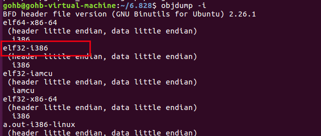

## Ubuntu 16 环境搭建

[简介]

主要分为两部分：

- x86模拟器 QEMU的安装
- 编译器工具链

参考链接： https://pdos.csail.mit.edu/6.828/2018/tools.html


### 编译器工具链

“编译器工具链”是一组程序，包括 C 编译器、汇编器和链接器，可将代码转换为可执行的二进制文件。您需要一个编译器工具链，它可以为 32 位 Intel 架构（“x86”架构）生成 ELF 二进制格式的代码

##### 测试编译器工具链

```shell
gohb@gohb-virtual-machine:~/6.828$ objdump -i
```



如上图，第二行显示 elf32-i386

```shell
gohb@gohb-virtual-machine:~/6.828$ gcc -m32 -print-libgcc-file-name
```

该命令应该打印类似 `/usr/lib/gcc/i486-linux-gnu/ *version* /libgcc.a`或 `/usr/lib/gcc/x86_64-linux-gnu/ *version* /32/libgcc.a`

如果这两个命令都成功了，那么你就准备好了，不需要编译你自己的工具链。

如果gcc命令失败，您可能需要安装开发环境。在 Ubuntu Linux 上，试试这个：

```shell
% sudo apt-get install -y build-essential gdb
```

在 64 位机器上，您可能需要安装 32 位支持库。症状是链接失败，并显示“`找不到 __udivdi3` ”和“`找不到 __muldi3` ”等错误消息。在 Ubuntu Linux 上，试试这个来解决问题：

```shell
% sudo apt-get install gcc-multilib
```


## QEMU 安装

1. 安装 git

```shell
gohb@gohb-virtual-machine:~$ sudo apt install git
```

2. clone QEMU

```shell
gohb@gohb-virtual-machine:~/6.828$ git clone https://github.com/mit-pdos/6.828-qemu.git qemu
```

3. 安装相关依赖

```shell
gohb@gohb-virtual-machine:~/6.828/lab$ sudo apt install libsdl1.2-dev libglib2.0-dev libz-dev libpixman-1-dev libtool*
```

4. 配置源代码

```shell
gohb@gohb-virtual-machine:~/6.828$ cd qemu/
gohb@gohb-virtual-machine:~/6.828/qemu$ ./configure --disable-kvm --target-list="i386-softmmu x86_64-softmmu"
```

执行

```
./configure --disable-kvm --target-list="i386-softmmu x86_64-softmmu"
```

。这一步可能会报错：

问题1：

1. 出现：`ERROR: Python not found. Use --python=/path/to/python`
2. 解决：添加`--python=python3`，还是不行提示`Note that Python 3 or later is not yet supported`。安装python2.7，然后使用`--python=python2.7`选项。

问题2：

1. 出现：`ERROR: pkg-config binary 'pkg-config' not found`
2. 解决：执行`apt-get install -y pkg-config`

问题3：

1. 出现：`ERROR: zlib check failed. Make sure to have the zlib libs and headers installed.`
2. 解决：执行`sudo apt-get install zlib1g-dev`

问题4：

1. 出现：`ERROR: glib-2.12 gthread-2.0 is required to compile QEMU`
2. 解决：`sudo apt-get install libglib2.0-dev`

问题5：

1. 出现：`ERROR: pixman >= 0.21.8 not present.`
2. 解决：`sudo apt-get install libpixman-1-dev`

问题6：

1. 出现：`vl.c: In function ‘main’: vl.c:2778:5: error: ‘g_mem_set_vtable’ is deprecated [-Werror=deprecated-declarations] g_mem_set_vtable(&mem_trace); ^ In file included from /usr/include/glib-2.0/glib/glist.h:32:0, from /usr/include/glib-2.0/glib/ghash.h:33, from /usr/include/glib-2.0/glib.h:50, from vl.c:59: /usr/include/glib-2.0/glib/gmem.h:357:7: note: declared here void g_mem_set_vtable (GMemVTable *vtable); ^ cc1: all warnings being treated as errors rules.mak:57: recipe for target 'vl.o' failed make: *** [vl.o] Error 1`
2. 解决：QEMU源码根目录下的Makefile文件最后加上一行 QEMU_CFLAGS+=-w


5. make && make install

```shell
gohb@gohb-virtual-machine:~/6.828/qemu$ sudo make && make install
```

记得加sudo，否则安装时在/usr/local/share创建文件时会提示不够权限。

6. 安装 gcc-multilib 库

为了Lab1的内核能够顺利make，我们必须还需安装这个库。

```
gohb@gohb-virtual-machine:~/6.828/qemu$ sudo apt install gcc-multilib
```
